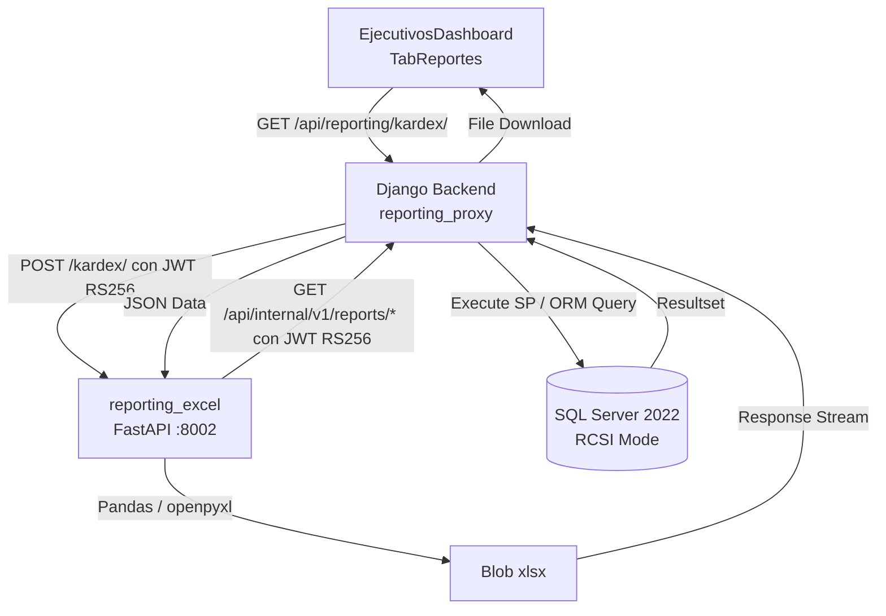
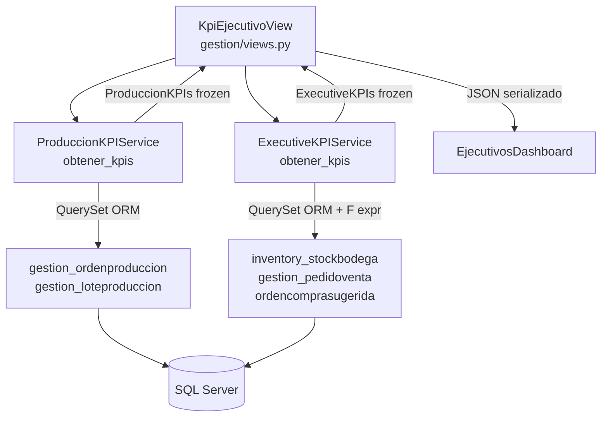
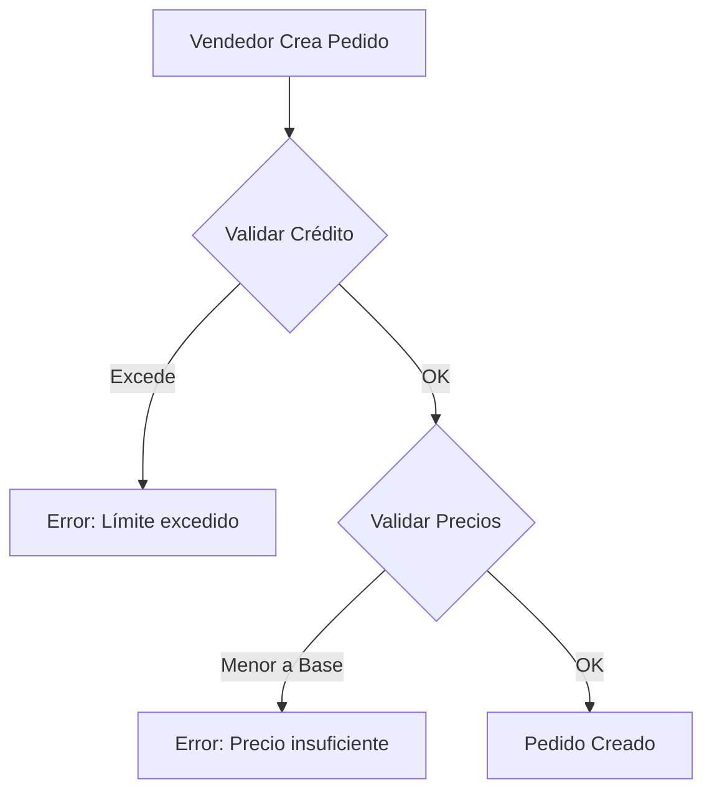
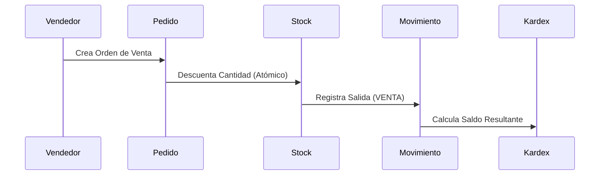

# Esquema de Base de Datos y Modelo de Negocio

Este documento detalla los modelos de datos de TexCore y las reglas de negocio críticas implementadas.

## 1. Aplicación: `gestion`

### `Sede`
Representa las sucursales físicas. Todo usuario (excepto admin_sistemas) debe estar asociado a una sede.

### `Cliente`
*   **limite_credito**: Límite máximo de deuda permitida.
*   **saldo_pendiente**: Propiedad dinámica calculada como la suma de TODOS los `PedidoVenta` no
    anulados (pagados o no, `total_con_iva - valor_retencion`) menos el total de `PagoCliente`
    registrados — no se filtra por `esta_pagado` (`ClienteManager.get_queryset`, anotación
    `saldo_calculado`).
*   **vendedor_asignado**: Relación con el usuario responsable (Filtro de seguridad en API).
*   **tiene_beneficio**: Flag para descuentos especiales (Solo modificable por Vendedores/Admins).

### `PedidoVenta` y `DetallePedido`
*   **Validación de Crédito**: Al crear un pedido, se valida: `saldo_actual + total_nuevo <= limite_credito`.
*   **Validación de Precio**: No se permite un `precio_unitario` inferior al `precio_base` del producto asociado.

### `Producto`
*   **precio_base**: Costo mínimo de venta definido por la gerencia.
*   **tipo**: Categorías (hilo, tela, quimico, subproducto, insumo, materia_prima).
*   **unidad_medida**: Soporta `kg`, `metros` y `unidades`.
*   **precisión métrica telas**: `cantidad_metros` utiliza `DECIMAL(12,4)` para precisión exacta en costeo y mermas.

## 2. Aplicación: `inventory`

### `StockBodega`
Saldo actual por bodega y lote. Soporta precisión decimal para trazabilidad exacta.

> **Nota de precisión:** `LoteProduccion.peso_neto_producido` puede almacenar internamente más de 2 decimales. Al crear `MovimientoInventario`, los valores se redondean con `.quantize(Decimal('0.01'))` para stock de kilos y `Decimal('0.0001')` para metros de tela. Esto aplica tanto al proceso de `rechazar` lote como a las descargas/reversiones de `DescargaQuimicosService`.

### `MovimientoInventario`
*   **Kardex**: Genera trazabilidad mediante el cálculo de `saldo_resultante` tras cada operación.
*   **Auditoría**: Los cambios en movimientos existentes quedan registrados en `AuditLog`.
*   **Integración Logística**: El campo `documento_ref` vincula movimientos con Pedidos, Órdenes de Producción o Guías de Despacho.

## 3. Aplicación: `production` y `tintura`

### `OrdenProduccion` (OP)
*   **Ciclo de Vida**: Pendiente -> En Proceso -> Finalizada.
*   **Asignación Atómica**: Vincula Producto, Fórmula de Color, Área, Máquina y Operario.
*   **Peso Neto Requerido**: Meta de producción que dispara el cierre automático al alcanzarse.

### `LoteProduccion`
*   Registro granular de cada unidad producida (bobina/rollo/funda).
*   Descuenta materias primas del inventario (teórico) basándose en la fórmula vinculada.

### `EventoEtiqueta`
*   Historial inmutable de cada evento de etiqueta física de un `LoteProduccion` (`related_name='etiquetas'`).
*   `tipo_evento`: `ORIGINAL` / `REIMPRESION` / `REETIQUETADO`.
*   `secuencia` (único por lote, siempre creciente) vs `version` (versión de **datos** — se mantiene igual entre reimpresiones idénticas, solo se incrementa en `REETIQUETADO`).
*   `anula_a` (self-FK) + `anulada`: cadena de versiones — el reetiquetado anula la etiqueta previa.
*   `codigo_lote` **nunca cambia** por un reetiquetado — solo cambian datos secundarios.
*   Ver detalle completo en [docs/modulos/GESTION_ETIQUETAS.md](../modulos/GESTION_ETIQUETAS.md).

### `FormulaColor`, `FaseReceta`, `ProcesoTintoreria` y `VersionFormula`
*   Estructura jerárquica: Fórmula -> Fases -> Detalles (Químicos). La receta "viva" es la que se edita.
*   **Tipo Sustrato**: Algodón, Poliéster, Nylon, Mixto, Otro.
*   **Fases**: cada `FaseReceta` apunta a un `ProcesoTintoreria` (catálogo **por sede**: Descrude, Tintura, Jabonado…, con tipo `pre_tratamiento`/`colorante`/`auxiliar`/`lavado`/`acabado`) y tiene `ciclo`, temperatura y tiempo. Reemplazó al antiguo enum de 5 fases (migración `0014`). `MaquinaProceso` registra qué procesos ejecuta cada máquina; `Maquina.volumen_bano_litros` es el volumen del baño (distinto de `capacidad_maxima`, kg/turno).
*   **Versionado inmutable** (`VersionFormula`, migración `0015`): aprobar una fórmula en pruebas crea la versión oficial v1; editar una fórmula aprobada exige motivo y crea la versión N+1 oficial (la anterior queda intacta y deja de ser oficial). Cada versión guarda la receta completa como JSON (`snapshot`), incluido código y descripción de cada químico para que siga legible si el producto se renombra o se da de baja. Una sola versión oficial por fórmula (índice filtrado). Solo `es_oficial` es mutable; el resto y el borrado se rechazan.
*   **Congelado en la OP**: `OrdenProduccion.version_formula` se fija al lanzar la orden (salir de `pendiente`) con la versión oficial vigente; sin versión oficial el lanzamiento se rechaza. Una orden lanzada no cambia de fórmula ni de versión. `OrdenProduccion.formula_color` y `version_formula` son `PROTECT`: una fórmula usada por órdenes no se puede borrar.
*   Servicio: `gestion/services/versionado_formula.py` (`VersionadoFormulaService`).

## 4. Gestión de Despacho y Servicios Satélite

### `HistorialDespacho`
*   Maestro de salida física que agrupa múltiples pedidos.
*   Calcula peso total real despachado vs teórico.

### `RequerimientoMaterial` (MRP)
*   Cálculo dinámico de faltantes: `Existencia - (Pedidos Pendientes + OPs en Proceso)`.
*   Genera `OrdenCompraSugerida` para reabastecimiento proactivo.

## 5. Consultas de Reportes de Producción y Gerenciales

Los reportes gerenciales y de producción se consultan directamente vía la API interna (`internal_api/services/reporting_data.py`) utilizando Django ORM con índices optimizados en SQL Server 2022 (`V2`, `V4`, `V5`). Los 21 Stored Procedures originales fueron eliminados como código muerto en la auditoría del 31 de agosto de 2026 para simplificar la arquitectura y eliminar overhead de traducción.

| Consulta / Reporte | Parámetros | Descripción |
|----|-----------|-------------|
| `sp_GetOrdenesProduccionGerencial` | `@FechaInicio DATE`, `@FechaFin DATE`, `@SedeID INT = NULL` | Detalle de OPs con producto, fórmula de color, sede, área, máquina, operario y avance (%). Incluye OPs sin lotes aún. |
| `sp_GetLotesProduccionGerencial` | `@FechaInicio DATE`, `@FechaFin DATE`, `@SedeID INT = NULL` | Lotes del período con `peso_bruto`, `tara`, `peso_neto`, `kg_por_hora` calculado, y duración en minutos. |
| `sp_GetTendenciaProduccionGerencial` | `@FechaInicio DATE`, `@FechaFin DATE`, `@SedeID INT = NULL` | Serie temporal diaria de kg producidos. Usa CTE `Calendario` para garantizar continuidad. |

**Nota**: `@SedeID = NULL` equivale a vista global (todas las sedes). El parámetro es nullable en todos los SPs.

### Flujo de datos: Service Layer → Reporting Excel

### Flujo de datos: KPI Ejecutivo (Service Layer)

## 6. Reversión de Pagos (Mayo 2026)

### `PagoCliente` — Reversión de abonos
El `PagoReversionService` permite deshacer un `PagoCliente` registrado:
- **Operación atómica** (`@transaction.atomic`): elimina el `PagoCliente` y restaura `Cliente.saldo_pendiente`.
- **Justificación obligatoria**: registrada en `AuditLog` junto con el usuario y timestamp.
- **Cálculo**: `saldo_anterior = saldo_actual + monto_pago`.
- **Post-reversión**: `PaymentReconciler` se ejecuta automáticamente para re-reconciliar los pedidos via FIFO.
- **Endpoints**: `POST /api/pagos-cliente/{id}/revertir/` (acción amigable) o `DELETE /api/pagos-cliente/{id}/` (con justificación en el body).

## 7. Diagramas de Proceso

### Flujo de Venta vs Crédito

### Flujo Logístico (Kardex)

