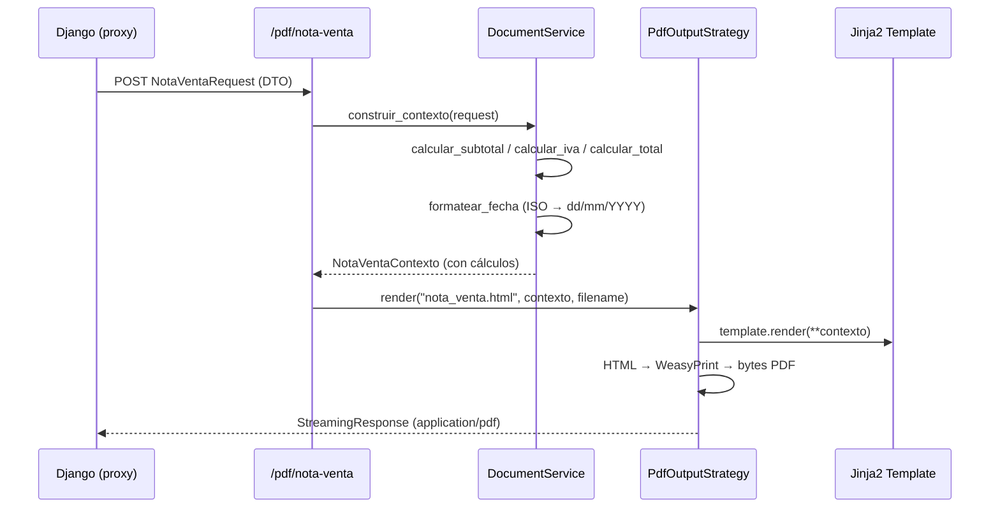

# Microservicio de Impresión (`printing_service`)

Microservicio FastAPI dedicado a la generación de documentos PDF (notas de venta) y etiquetas ZPL para impresoras Zebra. Desacopla las dependencias pesadas de WeasyPrint del núcleo Django.

> **Refactorizado:** 2026-04-23 — Se aplicó arquitectura de capas SOLID con Strategy Pattern y separación DTO/Servicio.

---

## Arquitectura de Capas

```
printing_service/src/
  config.py                  ← Rutas de templates ancladas al paquete (no al cwd)
  schemas/
    printing.py              ← DTOs de entrada (NotaVentaRequest, EtiquetaRequest)
                               + NotaVentaContexto (schema para el template)
  services/
    document_service.py      ← Lógica de negocio: cálculo IVA, subtotal, formateo de fecha
    output_strategy.py       ← Strategy Pattern: PdfOutputStrategy / ZplOutputStrategy
  routers/
    pdf.py                   ← POST /pdf/nota-venta
    zpl.py                   ← POST /zpl/etiqueta
    health.py                ← GET /health
  templates/
    nota_venta.html
    etiqueta.zpl
  main.py                    ← App factory pura (solo include_router)
```

### Diagrama de flujo de una solicitud PDF



---

## Patrones de Diseño Aplicados y su Justificación

### SRP — Separación de responsabilidades

**Problema anterior:** `NotaVentaRequest` era al mismo tiempo el schema de entrada HTTP **y** el portador de lógica de negocio (`@property subtotal`, `@property iva`, `@property total`). Además, el endpoint calculaba y formateaba fechas en línea.

**Solución:**

| Clase | Responsabilidad única |
|---|---|
| `NotaVentaRequest` | DTO de entrada: transporta datos del HTTP al servicio. Sin lógica. |
| `NotaVentaContexto` | Schema de salida para el template: lleva los cálculos ya hechos. |
| `DocumentService` | Toda la lógica de negocio: IVA, subtotal, total, formateo de fechas. |
| `PdfOutputStrategy` | Renderizar HTML → PDF con WeasyPrint. |
| `ZplOutputStrategy` | Renderizar template Jinja2 → texto ZPL. |
| `routers/pdf.py` | Solo traducir HTTP → DocumentService → Strategy → Response. |

### Strategy Pattern (OCP) — Formato de salida extensible

**Problema anterior:** El formato de salida estaba hardcodeado en el endpoint. Agregar soporte a PNG o HTML crudo requería modificar el endpoint existente.

**Solución:** `OutputStrategy` es un `Protocol` (interfaz) que define `render(template_name, context, filename) → Response`. Agregar un nuevo formato solo requiere una nueva clase:

```python
# Protocol definido en services/output_strategy.py
@runtime_checkable
class OutputStrategy(Protocol):
    def render(self, template_name: str, context: dict, filename: str) -> Response: ...

# Implementaciones concretas — agregar HtmlOutputStrategy no toca el router
class PdfOutputStrategy:   ...  # WeasyPrint
class ZplOutputStrategy:   ...  # Jinja2 texto plano
```

### Fragilidad operacional eliminada (config.py)

**Problema anterior:** `FileSystemLoader("templates")` dependía del directorio de trabajo al arrancar el proceso (`cwd`). En Docker, el proceso puede arrancar desde `/app` o `/app/src` según el `CMD`, rompiendo el servidor silenciosamente.

**Solución:**

```python
# config.py — ruta absoluta anclada al paquete
_SRC_DIR = Path(__file__).parent
TEMPLATES_DIR = str(_SRC_DIR / "templates")  # Siempre correcto sin importar cwd
```

### DIP — Inyección de dependencias vía FastAPI `Depends`

Cada router recibe su strategy vía `Depends`:

```python
def get_pdf_strategy() -> PdfOutputStrategy:
    env = Environment(loader=FileSystemLoader(TEMPLATES_DIR))
    return PdfOutputStrategy(env)

@router.post("/nota-venta")
async def generate_nota_venta_pdf(
    data: NotaVentaRequest,
    strategy: PdfOutputStrategy = Depends(get_pdf_strategy),  # ← DIP
):
    ...
```

Esto permite sobrescribir la strategy en tests (`app.dependency_overrides`) sin necesidad de mockear imports a nivel de módulo.

---

## Endpoints

### `GET /health`

Verifica que los templates requeridos existan en el sistema de archivos.

```json
200: { "status": "ok", "templates": "ok" }
503: { "detail": "Templates ausentes: ['nota_venta.html']" }
```

### `POST /pdf/nota-venta`

Genera la nota de venta en PDF.

**Body (`NotaVentaRequest`):**

```json
{
  "id": 42,
  "guia_remision": "GR-001",
  "fecha_pedido": "2026-04-23T10:00:00",
  "cliente_nombre": "Empresa XYZ",
  "cliente_ruc": "0990123456001",
  "esta_pagado": false,
  "valor_retencion": 5.0,
  "detalles": [
    {
      "producto_descripcion": "Hilo Nylon",
      "cantidad": 1.0,
      "piezas": 10,
      "peso": 25.0,
      "precio_unitario": 4.50,
      "incluye_iva": true
    }
  ]
}
```

**Response:** `StreamingResponse (application/pdf)` — archivo descargable.

> El `DocumentService` calcula internamente: subtotal, IVA (15% Ecuador sobre ítems con `incluye_iva=true`), total y formatea `fecha_pedido` a `dd/mm/YYYY HH:MM`.

### `POST /zpl/etiqueta`

Genera la etiqueta de producto en formato ZPL para impresoras Zebra.

**Body (`EtiquetaRequest`):**

```json
{
  "empresa": "TexCore Industrial",
  "producto_desc": "Hilo Nylon 100%",
  "lote_codigo": "LOTE-00123",
  "peso_neto": 25.5,
  "unidad": "kg",
  "qr_data": "https://texcore.local/lotes/LOTE-00123"
}
```

**Response:** `PlainTextResponse (text/plain)` — instrucciones ZPL listas para enviar a la impresora.

---

## Tests

```
tests/
  unit/
    test_document_service.py   ← 13 tests de DocumentService (sin HTTP, sin WeasyPrint)
  test_nota_venta_calculos.py  ← migrado para usar DocumentService.calcular_*
```

Los tests unitarios de `DocumentService` no requieren instalar WeasyPrint (la importación es lazy, dentro del método `render`). El CI los corre con `--cov-fail-under=80`.

---

## Integración con Django

Django envía los datos del pedido vía HTTP POST desde `gestion/utils.py`:

```python
pdf_content = PrintingService.generate_nota_venta_pdf(data_dict)
```

El servicio no accede a la base de datos; recibe todos los datos en el body.
