# Diagramas de Secuencia — Usuarios Principales del Sistema TexCore

> Stack: Django 5 + React/TypeScript + FastAPI (servicios satélite) + SQL Server + Docker + Nginx
>
> Autenticacion usuario: SimpleJWT (access + refresh token via `/api/token/`)
> Autenticacion servicio-a-servicio: JWT RS256 — clave privada en backend Django, clave publica distribuida a servicios satélite
> Servicios Satélite: `scanning_service` (:8000), `reporting_excel` (:8002), `printing_service` (:8001)
> El `scanning_service` NO tiene acceso directo a SQL Server — consume la Internal API de Django vía JWT RS256

---

## 1. Administrador de Sistemas

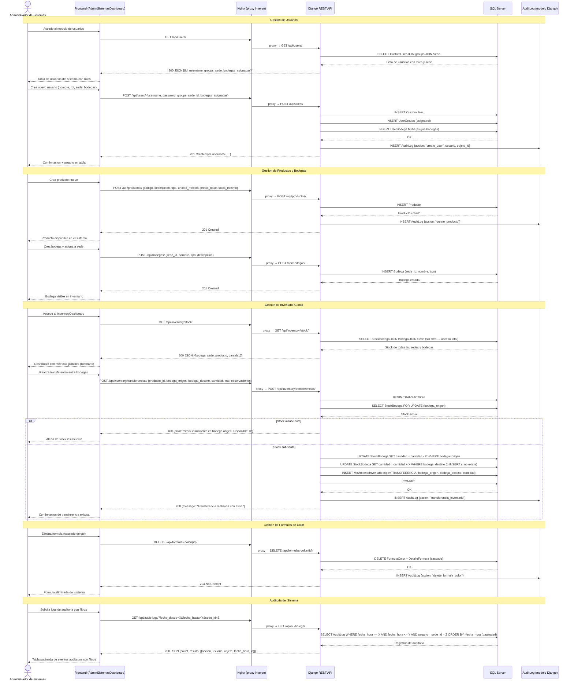

---

## 2. Bodeguero

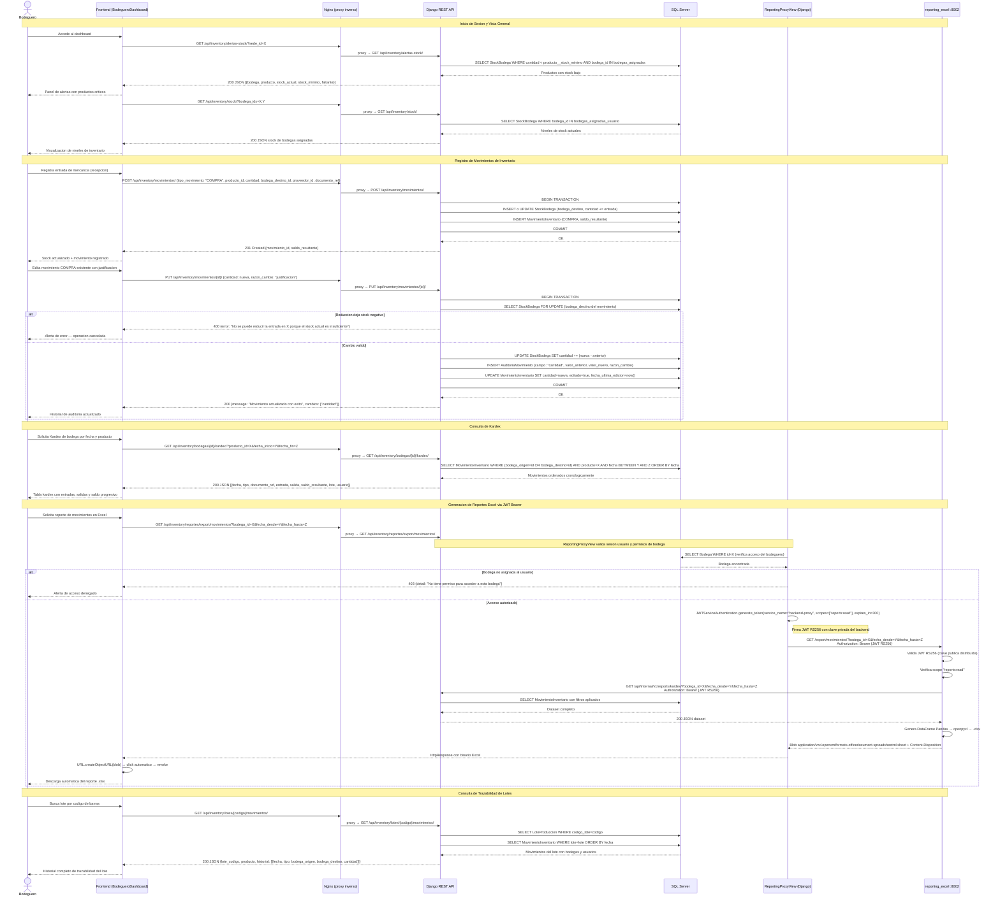

---

## 3. Operario

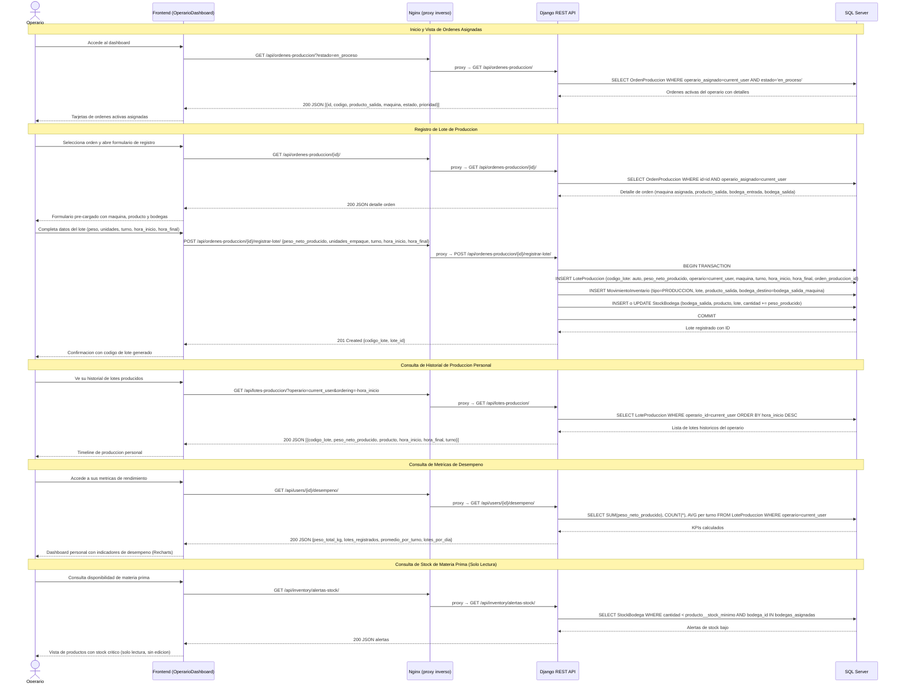

---

## 4. Ejecutivo

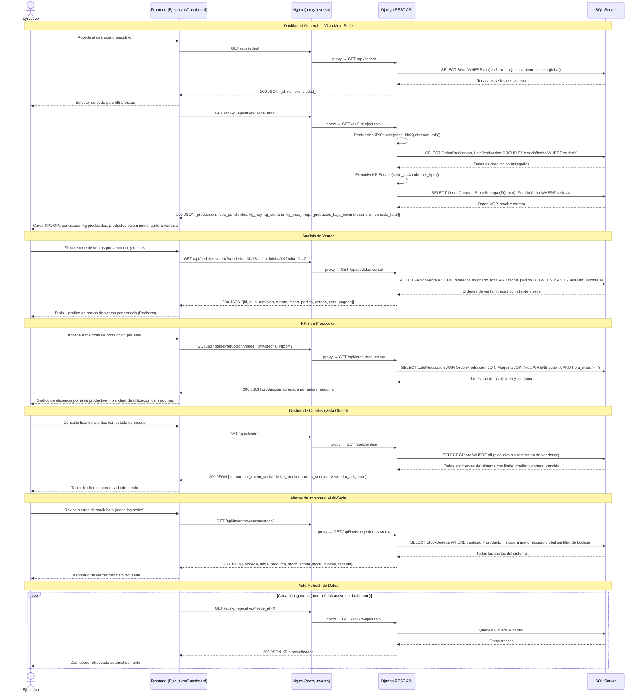

---

### CU-EJ-01: Ejecutivo consulta KPIs ejecutivos consolidados

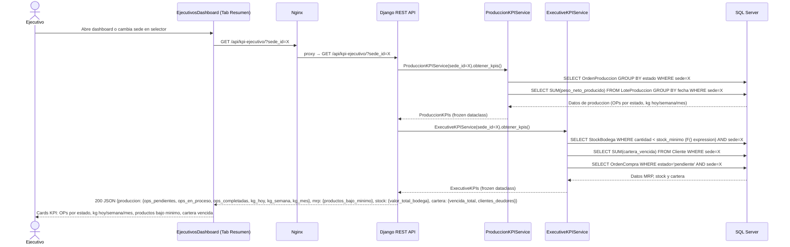

### CU-EJ-07: Ejecutivo descarga reporte gerencial Excel

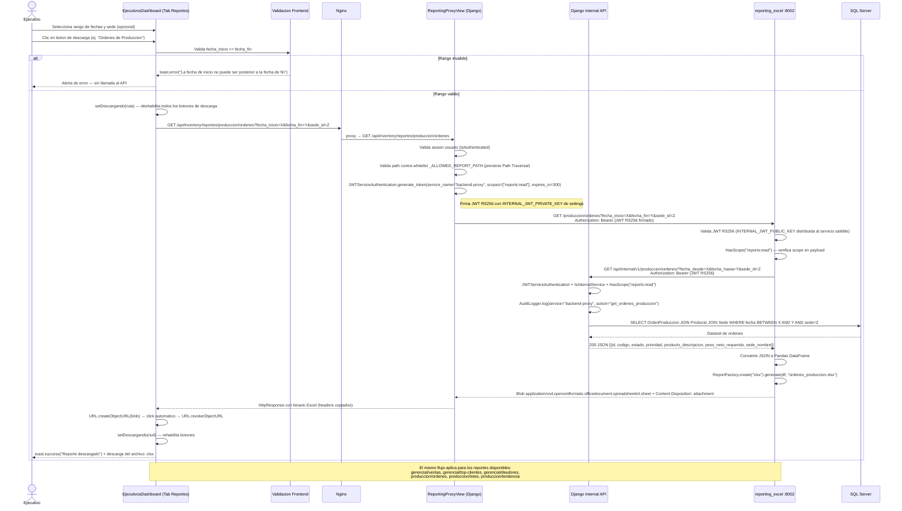

---

## 5. Ventas (Vendedor)

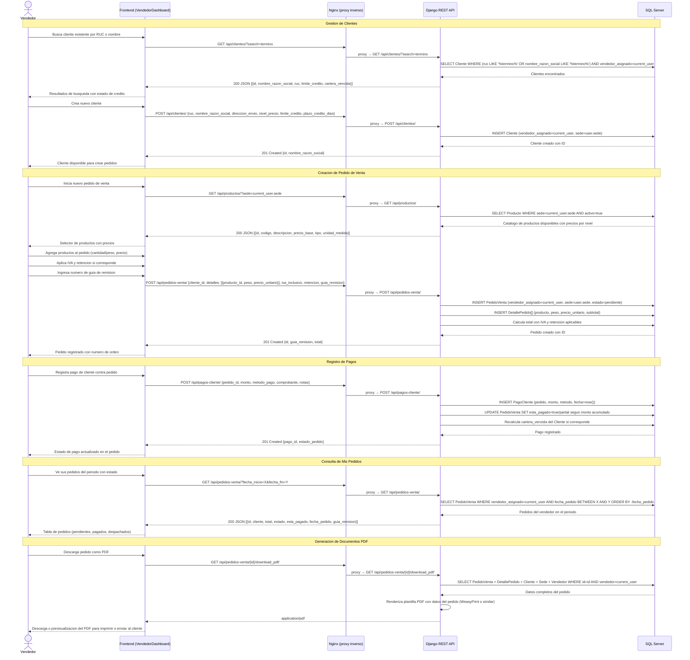

---

## 6. Encargado de Despacho

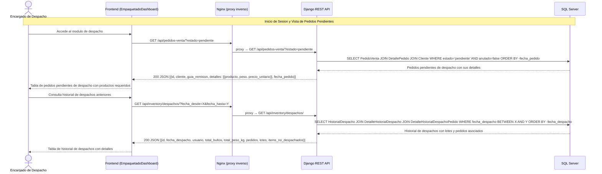

---

### CU-ED-01: Despacho con validacion de items incompletos

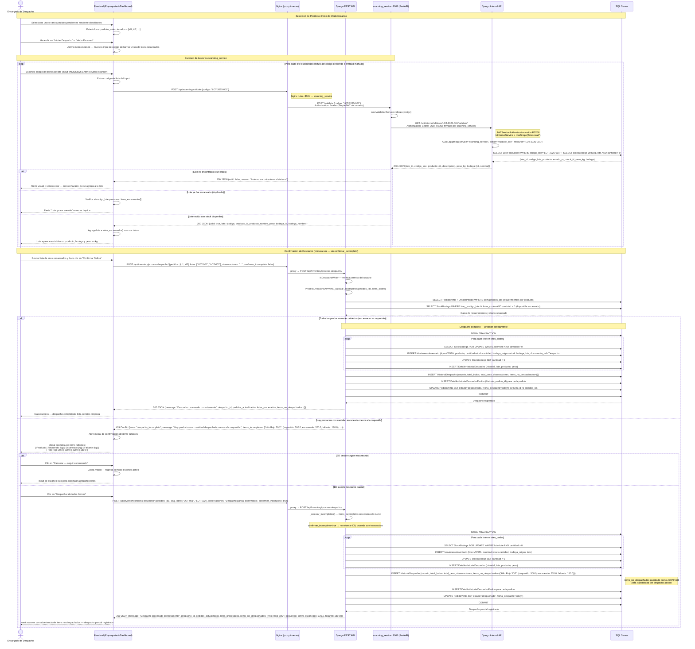

---

### CU-ED-02: Reversion de Despacho

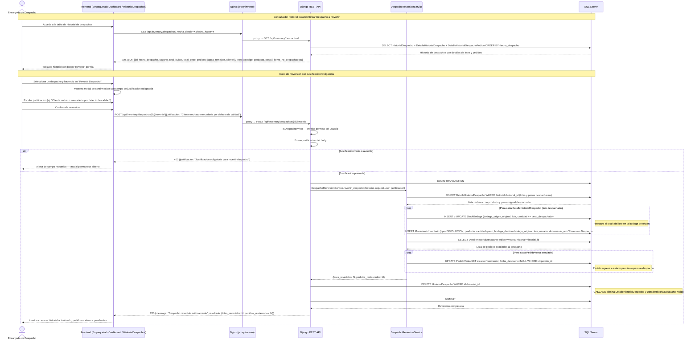

---

## Resumen de Permisos por Rol

| Accion | Admin Sistemas | Bodeguero | Operario | Jefe Area | Ejecutivo | Vendedor | Encargado Despacho |
|--------|:--------------:|:---------:|:--------:|:---------:|:---------:|:--------:|:------------------:|
| Gestion de usuarios | CRUD | - | - | - | - | - | - |
| Gestion de sedes y areas | CRUD | - | - | Ver | Ver | - | - |
| Gestion de productos | CRUD | Ver | - | Ver | Ver | Ver | Ver |
| Gestion de bodegas | CRUD | Ver (asignadas) | - | - | - | - | - |
| Stock — Ver todas las sedes | CRUD | Ver (asignadas) | Ver (alertas) | Ver (sede) | Ver (todas) | - | Ver |
| Movimientos de inventario | CRUD | CRUD | - | Ver | - | - | - |
| Lotes de produccion | CRUD | Ver | Crear | Ver | Ver | - | Ver |
| Ordenes de produccion | CRUD | - | Ver (propias) | CRUD (sede) | Ver | - | - |
| Formulas de color | CRUD | - | - | Ver | - | - | - |
| Clientes | CRUD | - | - | - | Ver | CRUD | - |
| Pedidos de venta | CRUD | - | - | - | Ver | CRUD (propios) | Ver (pendientes) |
| Pagos de clientes | CRUD | - | - | - | - | Crear | - |
| Despacho — iniciar y confirmar | CRUD | - | - | - | - | - | CRUD |
| Despacho — revertir | CRUD | - | - | - | - | - | CRUD |
| Historial de despachos | CRUD | Ver | - | Ver | Ver | - | CRUD |
| Reportes Excel (via proxy JWT) | CRUD | Parciales (bodegas asignadas) | - | Ver (sede) | Ver (todas) | Ver (propios) | Ver |
| Auditoria | Ver | Ver (inventario propio) | - | - | - | - | - |

---

## Arquitectura de Autenticacion — Referencia Rapida

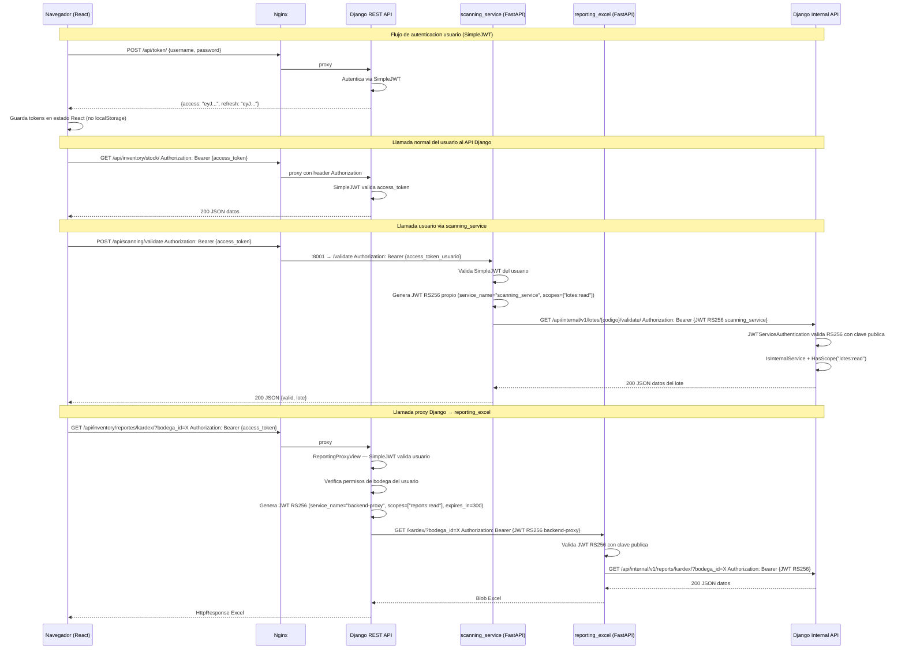
