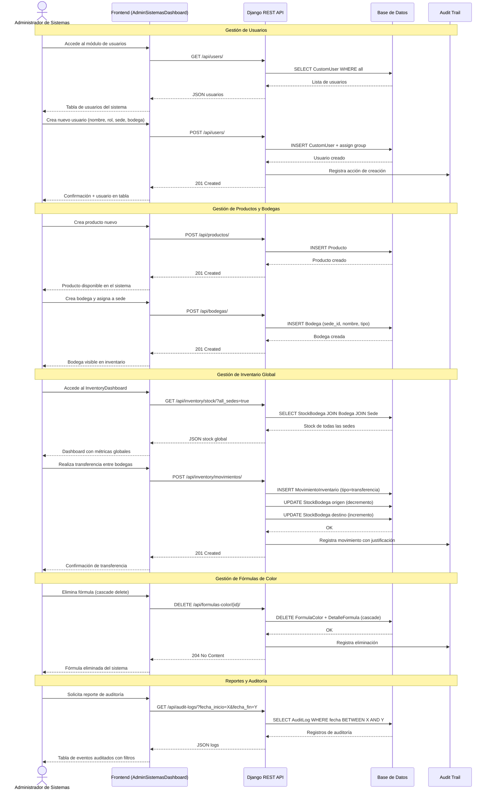
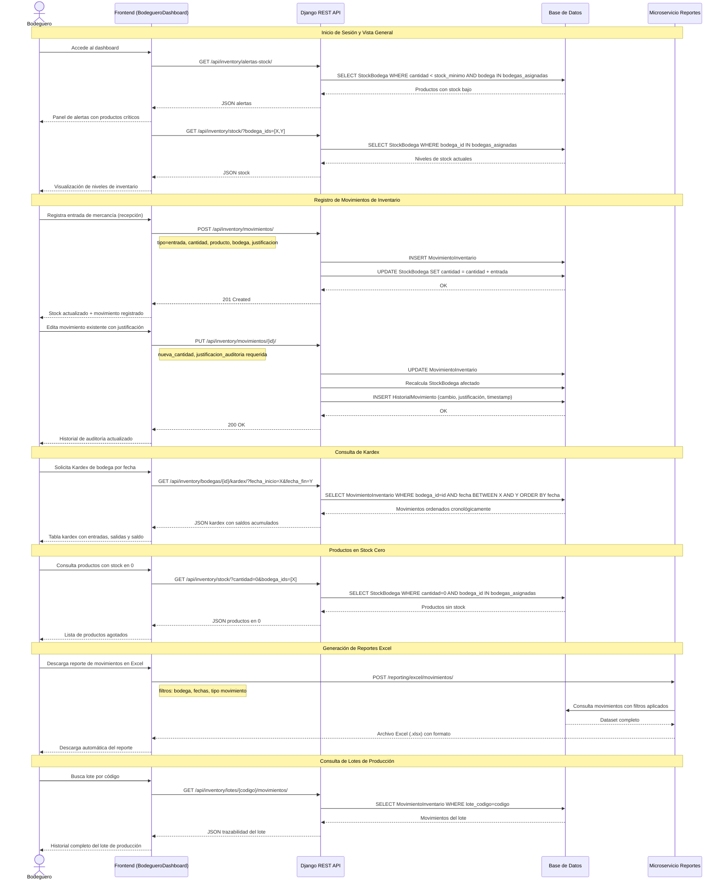
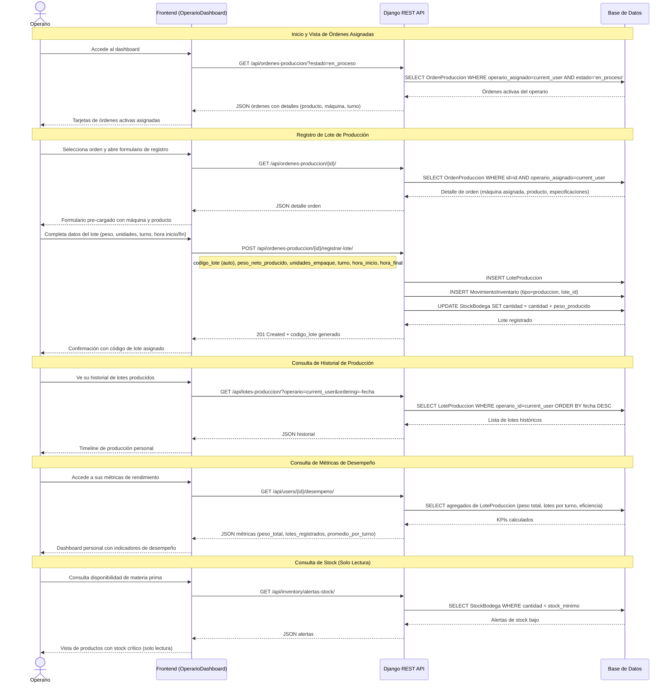
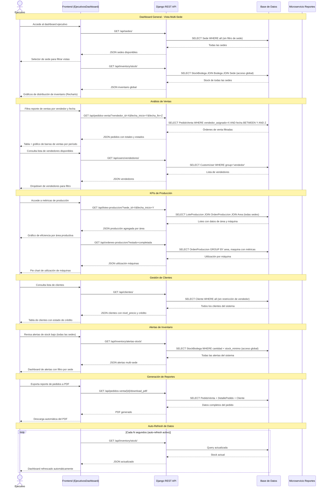
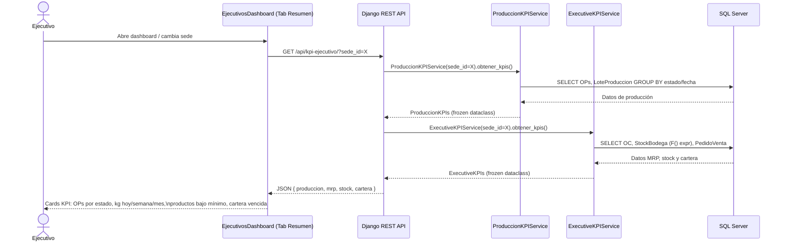
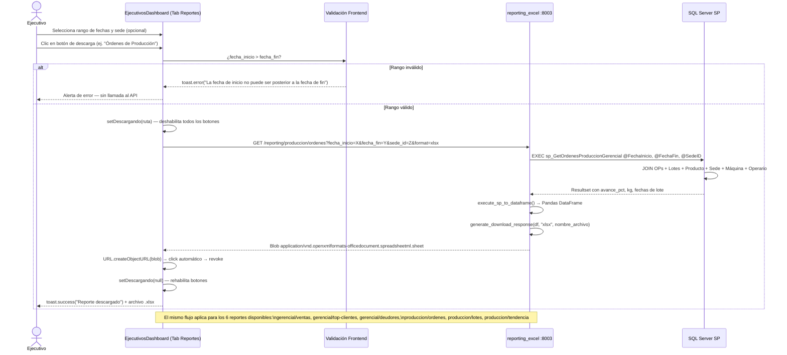
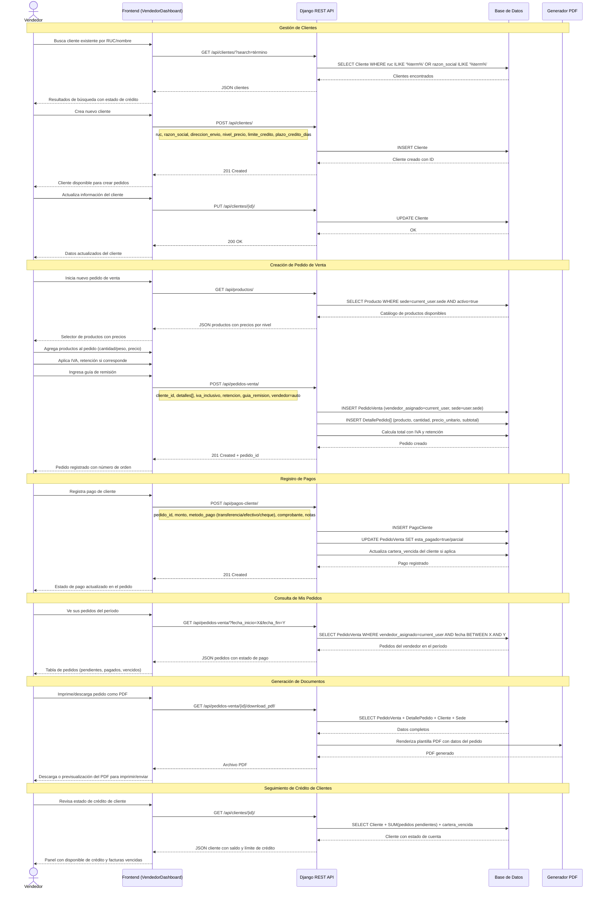

# Diagramas de Secuencia - Usuarios Principales del Sistema

## 1. Administrador de Sistemas

---

## 2. Bodeguero

---

## 3. Operario

---

## 4. Ejecutivo

---

> **[Sprint 6 — 2026-04-10]**

### CU-EJ-01: Ejecutivo consulta KPIs ejecutivos consolidados

### CU-EJ-07: Ejecutivo descarga reporte gerencial Excel

---

## 5. Ventas (Vendedor)

---

## Resumen de Permisos por Rol

| Acción | Admin Sistemas | Bodeguero | Operario | Ejecutivo | Ventas |
|--------|:--------------:|:---------:|:--------:|:---------:|:------:|
| Gestión de usuarios | CRUD | - | - | - | - |
| Gestión de sedes/áreas | CRUD | - | - | Ver | - |
| Gestión de productos | CRUD | Ver | - | Ver | Ver |
| Gestión de bodegas | CRUD | Ver | - | - | - |
| Stock - Ver (todas las sedes) | CRUD | Ver (asignadas) | Ver | Ver (todas) | - |
| Movimientos de inventario | CRUD | CRUD | - | - | - |
| Lotes de producción | CRUD | Ver | Crear | Ver | - |
| Órdenes de producción | CRUD | - | Ver (propias) | Ver | - |
| Fórmulas de color | CRUD | - | - | - | - |
| Clientes | CRUD | - | - | Ver | CRUD |
| Pedidos de venta | CRUD | - | - | Ver | CRUD (propios) |
| Pagos de clientes | CRUD | - | - | - | Crear |
| Reportes globales | CRUD | Parciales | - | Ver | Ver (propios) |
| Auditoría | Ver | Ver (inventario) | - | - | - |
