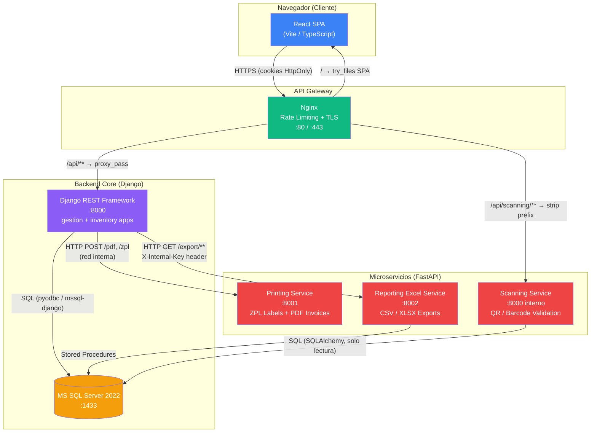
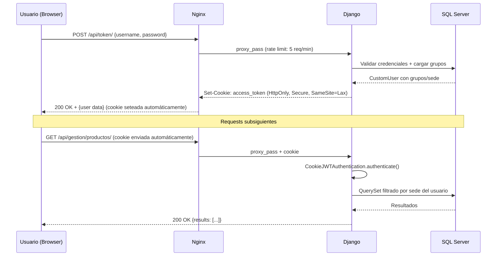
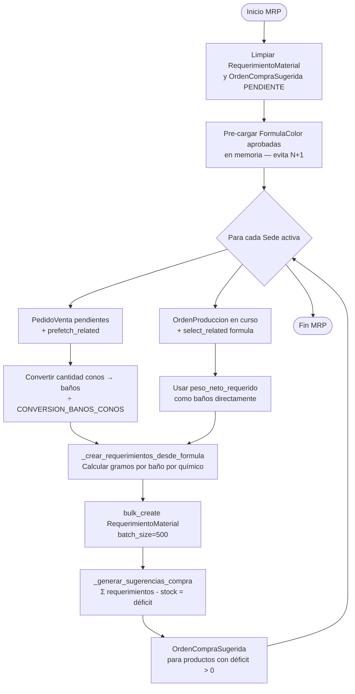

# TexCore ERP — Documentación Técnica y de Negocio

> **Versión:** 2.0 — Actualizada el 2026-04-03  
> **Rama analizada:** `staging`  
> **Audiencia:** Desarrolladores (onboarding), Arquitectos de Software, Gerencia Técnica

---

## Índice

1. [Visión General del Sistema](#1-visión-general-del-sistema)
2. [Arquitectura del Sistema](#2-arquitectura-del-sistema)
   - 2.1 [Diagrama de Arquitectura (Mermaid)](#21-diagrama-de-arquitectura)
   - 2.2 [Responsabilidades por Componente](#22-responsabilidades-por-componente)
   - 2.3 [Flujo de Autenticación](#23-flujo-de-autenticación)
3. [Modelo de Datos y Lógica de Negocio](#3-modelo-de-datos-y-lógica-de-negocio)
   - 3.1 [Entidades Principales (gestion)](#31-entidades-principales-gestion)
   - 3.2 [Entidades de Inventario](#32-entidades-de-inventario)
   - 3.3 [Sistema de Auditoría](#33-sistema-de-auditoría)
   - 3.4 [Procesos de Negocio Críticos](#34-procesos-de-negocio-críticos)
4. [Motor MRP](#4-motor-mrp)
5. [Seguridad y Roles (RBAC)](#5-seguridad-y-roles-rbac)
   - 5.1 [Roles de Usuario](#51-roles-de-usuario)
   - 5.2 [Clases de Permisos DRF](#52-clases-de-permisos-drf)
   - 5.3 [Multi-Tenancy por Sede](#53-multi-tenancy-por-sede)
6. [Arquitectura Frontend](#6-arquitectura-frontend)
   - 6.1 [Navegación Híbrida con useSearchParams](#61-navegación-híbrida-con-usesearchparams)
   - 6.2 [Autenticación en el Cliente](#62-autenticación-en-el-cliente)
   - 6.3 [Enrutamiento por Rol](#63-enrutamiento-por-rol)
   - 6.4 [Librerías Clave](#64-librerías-clave)
7. [Microservicios](#7-microservicios)
   - 7.1 [Printing Service (Puerto 8001)](#71-printing-service-puerto-8001)
   - 7.2 [Scanning Service (Puerto 8000 interno)](#72-scanning-service-puerto-8000-interno)
   - 7.3 [Reporting Excel Service (Puerto 8002)](#73-reporting-excel-service-puerto-8002)
8. [API Gateway — Nginx](#8-api-gateway--nginx)
9. [Guía de Despliegue y Configuración](#9-guía-de-despliegue-y-configuración)
   - 9.1 [Variables de Entorno Requeridas](#91-variables-de-entorno-requeridas)
   - 9.2 [Entorno de Desarrollo](#92-entorno-de-desarrollo)
   - 9.3 [Entorno de Producción](#93-entorno-de-producción)
   - 9.4 [Proceso de Inicio del Contenedor (entrypoint.sh)](#94-proceso-de-inicio-del-contenedor-entrypointsh)
10. [Referencia de la API REST](#10-referencia-de-la-api-rest)
11. [Observaciones y Mejoras Sugeridas](#11-observaciones-y-mejoras-sugeridas)

---

## 1. Visión General del Sistema

**TexCore** es un sistema ERP (Enterprise Resource Planning) diseñado específicamente para el **sector textil**. Centraliza y automatiza las operaciones de:

| Módulo | Descripción |
|--------|-------------|
| **Inventario** | Gestión de stock por bodega, Kardex, transferencias, ajustes y auditoría de movimientos |
| **Producción** | Órdenes de producción, lotes, asignación de máquinas y operarios |
| **Tintorería** | Fórmulas de color, fases de receta, cálculo de dosificación química |
| **Ventas / Facturación** | Pedidos de venta, clientes con control de crédito, notas de venta en PDF |
| **Despacho / Logística** | Validación por escaneo QR, historial de despachos, pesaje y bultos |
| **MRP** | Cálculo automático de requerimientos de materiales y órdenes de compra sugeridas |
| **Reportes** | Exportaciones masivas en CSV/XLSX (Kardex, valorización, rotación, envejecimiento) |

**Stack tecnológico resumido:**

| Capa | Tecnología |
|------|-----------|
| Backend Core | Python 3.12, Django 5.x, Django REST Framework 3.16 |
| Base de Datos | Microsoft SQL Server 2022 Express (`mssql-django` + `pyodbc`) |
| Microservicios | Python 3.12, FastAPI, Pydantic v2 |
| Frontend | React 18, TypeScript, Vite, TailwindCSS, shadcn/ui |
| Proxy / Gateway | Nginx (TLS 1.2/1.3, rate limiting) |
| Contenedores | Docker + Docker Compose (dev y prod) |
| Autenticación | JWT con cookies HttpOnly (`djangorestframework-simplejwt`) |

---

## 2. Arquitectura del Sistema

### 2.1 Diagrama de Arquitectura



### 2.2 Responsabilidades por Componente

#### Django Core (`gestion` + `inventory`)
- **Único punto de verdad** para la lógica de negocio, permisos y acceso a datos.
- Expone una API REST completa con endpoints paginados, filtros y acciones personalizadas.
- Gestiona sesiones JWT vía cookies HttpOnly (el token nunca queda expuesto al JavaScript del cliente).
- Orquesta llamadas a los microservicios como *proxy* (el frontend no se comunica directamente con los microservicios de impresión ni reportes).
- Implementa el sistema de auditoría transversal (`AuditableModelMixin`, `AuditMiddleware`).

#### Nginx (API Gateway)
- **Único punto de entrada externo** en producción.
- Termina TLS (TLSv1.2 / TLSv1.3).
- Aplica rate limiting diferenciado por zona de ruta.
- Sirve el build estático de React como SPA (fallback a `/index.html`).
- Enruta `/api/scanning/` al microservicio de escaneo eliminando el prefijo antes del proxy.

#### Printing Service
- Genera **etiquetas ZPL** para impresoras térmicas Zebra con datos del lote y código QR.
- Genera **PDFs de notas de venta** usando Jinja2 + WeasyPrint.
- No requiere acceso a la base de datos; recibe todos los datos en el body del `POST`.
- Solo accesible desde la red interna de Docker.

#### Scanning Service
- Valida en tiempo real si un código de lote escaneado es **despachable**: existe, tiene orden de producción y tiene stock disponible.
- Acceso de **solo lectura** a la base de datos vía SQLAlchemy.
- Es el único microservicio expuesto directamente al frontend (vía Nginx).

#### Reporting Excel Service
- Ejecuta **stored procedures** de alto rendimiento en SQL Server para extraer grandes volúmenes de datos.
- Serializa la respuesta en CSV o XLSX según el parámetro `?format=`.
- Protegido por el header `X-Internal-Key` (shared secret en variables de entorno).
- Solo accesible desde la red interna Docker; Django actúa como proxy para el frontend.

### 2.3 Flujo de Autenticación



---

## 3. Modelo de Datos y Lógica de Negocio

### 3.1 Entidades Principales (gestion)

#### `Sede` — Unidad de negocio / Planta
Raíz del árbol de multi-tenancy. Prácticamente todas las entidades tienen una FK a `Sede`.

```
Sede
├── nombre (único)
├── location
└── status: activo | inactivo

Relaciones descendientes:
└── Area, Bodega, CustomUser, Cliente, Producto, FormulaColor,
    OrdenProduccion, PedidoVenta
```

---

#### `CustomUser` — Usuario del sistema
Extiende `AbstractUser` de Django con campos de negocio.

```
CustomUser
├── sede (FK → Sede, nullable)
├── area (FK → Area, nullable)
├── bodegas_asignadas (M2M → Bodega)
└── superior (M2M self-referencial → CustomUser)
```

Los **grupos de Django** determinan el rol funcional del usuario (ver sección 5.1).

---

#### `Producto` — Catálogo unificado de materiales

```
Producto
├── codigo (único)
├── tipo: hilo | tela | subproducto | quimico | insumo
├── unidad_medida: kg | metros | unidades
├── stock_minimo
├── precio_base
├── presentacion   ← unidad de empaque (baño, funda, cono)
└── sede (nullable → producto global si NULL, visible para todas las sedes)
```

> **Regla de negocio:** Los vendedores no pueden ver productos de tipo `quimico` (restricción en `ProductoViewSet.get_queryset()`).

---

#### `FormulaColor` — Receta de tinte (Auditable)

```
FormulaColor
├── codigo (único), nombre_color (único)
├── tipo_sustrato: algodon | poliester | nylon | mixto | otro
├── estado: en_pruebas | aprobada
├── version (se incrementa al duplicar)
└── creado_por (FK → CustomUser)

Estructura jerárquica:
FormulaColor
└── FaseReceta [orden, temperatura, tiempo]
    └── DetalleFormula
        ├── producto (solo tipo=quimico)
        ├── tipo_calculo: gr_l (concentración) | pct (agotamiento %)
        └── concentracion_gr_l / porcentaje
```

**Campos auditados:** `codigo`, `nombre_color`, `tipo_sustrato`, `estado`, `observaciones`.  
**Justificación obligatoria** en cualquier modificación.

---

#### `OrdenProduccion` — Orden de fabricación

```
OrdenProduccion
├── codigo (único)
├── producto, formula_color, bodega, area, sede
├── peso_neto_requerido   ← en kg / baños
├── estado: pendiente | en_proceso | finalizada
├── inventario_descontado (bool)   ← previene doble descuento de stock
├── maquina_asignada, operario_asignado
└── lotes: [LoteProduccion]
```

---

#### `LoteProduccion` — Lote de producción físico

```
LoteProduccion
├── codigo_lote (único, generado automáticamente)
├── orden_produccion (FK, nullable)
├── peso_neto_producido, peso_bruto, tara
├── unidades_empaque, presentacion: baño | funda | cono
├── cantidad_metros   ← para telas
└── operario, maquina, turno, hora_inicio, hora_final
```

**Conversiones de presentación** (validadas en `clean()`):

| De | A | Factor |
|----|---|--------|
| 1 baño | fundas | 15 |
| 1 funda | conos | 15 |
| 1 baño | conos | 225 |

---

#### `Cliente` — Cliente comercial (Auditable)

```
Cliente
├── ruc_cedula (único), nombre_razon_social, direccion_envio
├── nivel_precio: mayorista | normal
├── tiene_beneficio (bool)
├── limite_credito, plazo_credito_dias
├── vendedor_asignado (FK → CustomUser)
└── sede (FK → Sede)

Propiedades calculadas vía ORM Subquery (anotadas en el QuerySet):
├── saldo_calculado   = Σ pedidos pendientes - Σ pagos registrados
└── cartera_vencida   = saldo de pedidos vencidos sin pago
```

---

#### `PedidoVenta` — Orden de venta

```
PedidoVenta
├── cliente (FK → Cliente)
├── guia_remision, fecha_pedido, fecha_despacho, fecha_vencimiento
├── estado: pendiente | despachado | facturado
├── esta_pagado (bool)
└── detalles: [DetallePedido]
               ├── producto, lote, cantidad, piezas, peso
               ├── precio_unitario, incluye_iva (bool)
               └── subtotal, total_con_iva   ← calculados en save()
```

### 3.2 Entidades de Inventario

#### `StockBodega` — Posición de stock actual (Auditable)

```
StockBodega
├── bodega (FK → Bodega)
├── producto (FK → Producto)
├── lote (FK → LoteProduccion, nullable)
└── cantidad (Decimal 12,2)

Constraints únicos:
- UNIQUE (bodega, producto)       WHERE lote IS NULL
- UNIQUE (bodega, producto, lote) WHERE lote IS NOT NULL
```

---

#### `MovimientoInventario` — Libro contable (Kardex)

```
MovimientoInventario
├── tipo_movimiento: COMPRA | PRODUCCION | TRANSFERENCIA | AJUSTE |
│                   VENTA | DEVOLUCION | CONSUMO
├── producto, lote
├── bodega_origen, bodega_destino
├── cantidad
├── saldo_resultante   ← desnormalizado para consultas rápidas de Kardex
├── documento_ref, usuario, proveedor, pais, calidad
├── editado (bool), fecha_ultima_edicion
└── observaciones
```

**Índice en DB:** `(bodega_origen, fecha) INCLUDE (producto, cantidad, saldo_resultante)` — optimiza Kardex sobre grandes volúmenes.

---

#### `HistorialDespacho` — Registro físico de despacho

```
HistorialDespacho
├── fecha_despacho, usuario
├── total_bultos, total_peso
├── detalles: [DetalleHistorialDespacho]
│              └── lote, producto, peso, es_devolucion (bool)
└── pedidos: [PedidoVenta] via DetalleHistorialDespachoPedido
               └── cantidad_despachada
```

---

#### `RequerimientoMaterial` + `OrdenCompraSugerida` — Salidas del MRP

```
RequerimientoMaterial
├── producto_requerido, cantidad_necesaria, sede
├── tipo_origen: PEDIDO | OP
└── origen_id   ← ID del pedido u orden que generó el requerimiento

OrdenCompraSugerida
├── producto, sede, cantidad_sugerida
├── estado: PENDIENTE | APROBADA | RECHAZADA
└── UNIQUE (producto, sede, estado=PENDIENTE)   ← solo una sugerencia pendiente por producto/sede
```

### 3.3 Sistema de Auditoría

Todo modelo que hereda de `AuditableModelMixin` genera automáticamente registros en `AuditLog` al crear, modificar o eliminar.

```python
class AuditableModelMixin(models.Model):
    # Lista de campos vigilados — solo estos generan entradas en AuditLog
    campos_auditables = ['campo1', 'campo2']

    # Si True, lanza ValidationError si no se provee _justificacion_auditoria
    requiere_justificacion_auditoria = True

    def save(self, *args, **kwargs):
        # 1. Compara valores anteriores vs nuevos para cada campo auditable
        # 2. Si requiere_justificacion y no hay _justificacion_auditoria → ValidationError
        # 3. Emite AuditLog con: usuario, IP, tabla, campo, valor_anterior, valor_nuevo
        ...
```

El `AuditMiddleware` inyecta automáticamente el usuario y la IP del request en el contexto del hilo actual. Para eliminaciones en cascada, `set_cascade_justification()` propaga la justificación a los objetos relacionados.

**Modelos auditados:** `StockBodega`, `MovimientoInventario`, `FormulaColor`, `DetalleFormula`, `Cliente`.

### 3.4 Procesos de Negocio Críticos

#### Registro de Movimiento de Inventario

```
POST /api/inventory/movimientos/

Flujo (atomic transaction):
1. Validar datos con MovimientoInventarioSerializer
2. Si lote_codigo en body → get_or_create LoteProduccion
3. Determinar dirección del stock:
   ├── COMPRA / PRODUCCION  → incrementar bodega_destino
   ├── VENTA / CONSUMO      → decrementar bodega_origen
   ├── TRANSFERENCIA        → decrementar origen + incrementar destino
   └── AJUSTE               → depende del signo de cantidad
4. select_for_update() sobre StockBodega → evita race conditions
5. Calcular saldo_resultante = último saldo conocido ± cantidad
6. Guardar MovimientoInventario con saldo_resultante
```

#### Rechazo de Lote de Producción

```
POST /api/gestion/lotes-produccion/{id}/rechazar/

Flujo (atomic transaction):
1. Verificar que el lote tiene OrdenProduccion asociada
2. Revertir stock de salida:
   └── Decrementar producto terminado en bodega destino
3. Reponer stock de entrada:
   └── Para cada DetalleFormula de la OP: incrementar químico/materia prima
4. Marcar lote como rechazado
5. Emitir MovimientoInventario tipo DEVOLUCION por cada ítem
```

#### Cálculo de Dosificación Química

```
POST /api/gestion/formulas-color/{id}/calcular_dosificacion/
Body: { "peso_tela_kg": 100, "relacion_bano": 10 }

Volumen de baño (L) = peso_tela_kg × relacion_bano
Para cada DetalleFormula:
  ├── tipo_calculo = gr_l → gramos = concentracion_gr_l × litros_bano
  └── tipo_calculo = pct  → gramos = (porcentaje / 100) × peso_tela_kg × 1000
```

---

## 4. Motor MRP

**Archivo:** `inventory/services/mrp_engine.py`

El MRP calcula los materiales necesarios para satisfacer la demanda actual y genera órdenes de compra sugeridas por sede.

### Constantes de conversión

```python
CONVERSION_BANOS_FUNDAS = Decimal('15')    # 1 baño = 15 fundas
CONVERSION_FUNDAS_CONOS = Decimal('15')    # 1 funda = 15 conos
CONVERSION_BANOS_CONOS  = Decimal('225')   # 1 baño = 225 conos
```

### Algoritmo `ejecutar_mrp()`



### Características de rendimiento

| Técnica | Beneficio |
|---------|-----------|
| Pre-carga de fórmulas en memoria (`_get_detalles_formula`) | Elimina N+1 en el bucle de sedes |
| `bulk_create(batch_size=500)` | Reduce round-trips a la base de datos |
| `select_related` / `prefetch_related` en queries de entrada | Minimiza consultas totales |
| `@transaction.atomic` | Garantiza consistencia si el proceso falla a mitad |
| `UNIQUE (producto, sede, PENDIENTE)` | Previene duplicados en sugerencias de compra |

**Disparador manual (frontend):**
```
POST /api/inventory/sugerencias-compra/ejecutar-mrp/
```

---

## 5. Seguridad y Roles (RBAC)

### 5.1 Roles de Usuario

Los roles se implementan como **grupos de Django**. Un usuario puede pertenecer a uno o más grupos.

| Rol (Grupo Django) | Descripción funcional | Dashboard asignado |
|---|---|---|
| `admin_sistemas` | Superadministrador. Acceso total a todas las sedes. | `AdminSistemasDashboard` |
| `admin_sede` | Administrador de una sede específica. Ve solo su sede. | `AdminSedeDashboard` |
| `jefe_planta` | Supervisa producción de toda la planta. | `JefePlantaDashboard` |
| `jefe_area` | Supervisa máquinas y operarios de su área asignada. | `JefeAreaDashboard` |
| `ejecutivo` | Visión de KPIs de ventas y financieros. | `EjecutivosDashboard` |
| `vendedor` | Gestiona clientes y pedidos de venta. No ve químicos. | `VendedorDashboard` |
| `bodeguero` | Registra entradas de compra, transferencias, Kardex. | `BodegueroDashboard` |
| `operario` | Registra lotes de producción. | `OperarioDashboard` |
| `empaquetado` | Registra empaque de lotes (peso bruto, presentación). | `EmpaquetadoDashboard` |
| `despacho` | Valida y registra despachos físicos por escaneo QR. | `DespachoDashboard` |
| `tintorero` | Gestiona fórmulas de color y dosificaciones. | `TintoreroDashboard` |

### 5.2 Clases de Permisos DRF

Definidas en `gestion/views.py`:

```python
class IsSystemAdmin(BasePermission):
    """Solo admin_sistemas o superuser. Acceso cross-sede."""
    def has_permission(self, request, view):
        return request.user.groups.filter(name='admin_sistemas').exists() \
               or request.user.is_superuser

class IsAdminSistemasOrSede(BasePermission):
    """admin_sistemas, admin_sede, o superuser."""

class IsTintoreroOrAdmin(BasePermission):
    """tintorero o admin_sistemas. Para endpoints de fórmulas de color."""

class IsJefeAreaOrAdmin(BasePermission):
    """jefe_area (solo su área) o admin. Para métricas de eficiencia."""
    def has_object_permission(self, request, view, obj):
        if request.user.groups.filter(name='admin_sistemas').exists():
            return True
        return obj.area == request.user.area   # Aislamiento estricto por área
```

### 5.3 Multi-Tenancy por Sede

El aislamiento entre sedes se aplica **imperativamante en el backend**, nunca solo en el frontend:

```python
# Patrón estándar en ViewSets multi-tenant (ej. ProductoViewSet)
def get_queryset(self):
    user = self.request.user
    if user.groups.filter(name='admin_sistemas').exists():
        return Producto.objects.all()               # Ve todos
    elif user.sede:
        return Producto.objects.filter(
            models.Q(sede=user.sede) | models.Q(sede__isnull=True)
        )                                           # Su sede + productos globales
    return Producto.objects.none()
```

Los productos sin sede (`sede=NULL`) son **globales** y visibles para todas las sedes. Los demás registros solo son visibles para usuarios de la misma sede.

---

## 6. Arquitectura Frontend

### 6.1 Navegación Híbrida con useSearchParams

TexCore implementa un patrón de **Navegación Híbrida** donde el estado de la UI (vista activa, filtros, paginación) se persiste en los **parámetros de la URL** en lugar del estado local de React.

**Beneficios:**
- Compartir URLs con el estado exacto de la vista.
- El botón "atrás" del navegador navega entre vistas del dashboard.
- Refresco de página sin perder el contexto de navegación.

**Patrón de implementación:**

```typescript
// Ejemplo aplicado en BodegueroDashboard, InventoryDashboard, etc.
const [searchParams, setSearchParams] = useSearchParams();

// Leer estado desde la URL
const activeView  = searchParams.get('view')   ?? 'stock';
const currentPage = parseInt(searchParams.get('page') ?? '1');
const searchTerm  = searchParams.get('search') ?? '';

// Navegar entre vistas (actualiza la URL sin recargar la página)
const navigateTo = (view: string) => {
  setSearchParams({ view, page: '1' });
};

// Cambiar de página
const handlePageChange = (page: number) => {
  setSearchParams(prev => { prev.set('page', String(page)); return prev; });
};
```

**Ejemplos de URLs generadas:**
```
/bodeguero?view=kardex&bodega=3&page=2&search=hilo+azul
/despacho?view=historial&fecha_desde=2026-01-01
/admin?view=inventario&tab=transferencias
```

### 6.2 Autenticación en el Cliente

**Archivo:** `frontend/src/lib/auth.tsx`

```typescript
interface AuthContextType {
  profile: Profile | null;
  login(username: string, password: string): Promise<boolean>;
  logout(): Promise<void>;
  isAuthenticated: boolean;
  isLoading: boolean;
}
```

**Flujo de sesión:**
1. Al cargar la app → `GET /api/profile/` para verificar sesión activa (la cookie HttpOnly se envía automáticamente).
2. Login → `POST /api/token/` → Django emite cookie `access_token` (HttpOnly, Secure, SameSite=Lax).
3. Axios envía la cookie automáticamente en cada request (`withCredentials: true`).
4. Logout → `POST /api/token/logout/` → Django invalida la cookie.

> **El token JWT nunca es accesible desde JavaScript**, mitigando ataques XSS de robo de credenciales.

### 6.3 Enrutamiento por Rol

**Archivo:** `frontend/src/App.tsx`

```typescript
// Enrutamiento basado en profile.role (nombre del grupo Django)
const dashboardMap: Record<string, React.ComponentType> = {
  admin_sistemas: AdminSistemasDashboard,
  admin_sede:     AdminSedeDashboard,
  jefe_planta:    JefePlantaDashboard,
  jefe_area:      JefeAreaDashboard,
  ejecutivo:      EjecutivosDashboard,
  vendedor:       VendedorDashboard,
  bodeguero:      BodegueroDashboard,
  operario:       OperarioDashboard,
  empaquetado:    EmpaquetadoDashboard,
  despacho:       DespachoDashboard,   // sub-ruta: /despacho/historial
  tintorero:      TintoreroDashboard,
};
```

Cada dashboard es un **componente contenedor** que renderiza sub-vistas según el parámetro `?view=` de la URL. El componente `MRPDashboard` es **compartido** y puede ser incluido en los dashboards de roles con acceso a planificación.

### 6.4 Librerías Clave

| Librería | Uso principal |
|----------|--------------|
| `react-router-dom` v6 | Routing SPA, `useSearchParams` |
| `axios` | Cliente HTTP con `withCredentials: true` |
| `shadcn/ui` | Componentes UI (Tabs, Card, Table, Badge, Dialog, Select, Skeleton) |
| `sonner` | Notificaciones toast (éxito, error, info) |
| `zod` | Validación de esquemas en formularios |
| `react-hook-form` | Gestión de formularios integrada con Zod |
| `TailwindCSS` | Utilidades CSS, diseño responsive |

---

## 7. Microservicios

### 7.1 Printing Service (Puerto 8001)

**Stack:** FastAPI + Jinja2 + WeasyPrint + Pydantic v2  
**Acceso:** Solo red interna Docker. Django actúa como proxy.

#### Endpoints

```
GET  /health
     → Verifica que las plantillas Jinja2 estén disponibles.

POST /pdf/nota-venta
     Body (NotaVentaRequest):
       cliente:  { nombre, ruc, direccion }
       productos: [{ descripcion, cantidad, precio, iva }]
       numero_documento: string
       fecha: string
     Response: StreamingResponse (application/pdf)

POST /zpl/etiqueta
     Body (EtiquetaRequest):
       empresa: string
       lote_codigo: string
       peso_neto: number
       qr_data: string
     Response: text/plain (instrucciones ZPL para impresora Zebra)
```

### 7.2 Scanning Service (Puerto 8000 interno)

**Stack:** FastAPI + SQLAlchemy (solo lectura) + Pydantic v2  
**Acceso:** Expuesto vía Nginx en `/api/scanning/`

#### Endpoints

```
GET  /
     → Información del servicio.

GET  /health
     → Verifica conectividad a la base de datos.

POST /validate
     Body: { "codigo_lote": "LOT-2026-001" }
     Response (LoteInfo):
       codigo: string
       producto_id: int,  producto_nombre: string
       peso: number
       bodega_id: int,    bodega_nombre: string
       disponible: boolean
     Validaciones: lote existe + tiene OrdenProduccion + stock > 0
```

**Caso de uso:** El operario de despacho escanea el QR de una caja. El frontend llama a `POST /api/scanning/validate` para confirmar que el lote es válido y despachable antes de incluirlo en el registro de despacho.

### 7.3 Reporting Excel Service (Puerto 8002)

**Stack:** FastAPI + pyodbc (stored procedures) + openpyxl/csv  
**Autenticación:** Header `X-Internal-Key` (shared secret)  
**Acceso:** Solo red interna Docker.

#### Endpoints de exportación

Todos los endpoints aceptan `?format=csv` (default) o `?format=xlsx`.

| Endpoint | Stored Procedure | Parámetros |
|----------|-----------------|-----------|
| `GET /export/kardex` | `sp_GetKardexBodega` | `bodega_id`\*, `producto_id`, `proveedor_id`, `fecha_inicio`, `fecha_fin`, `lote_codigo` |
| `GET /export/productos` | — | `sede_id`, `tipo` |
| `GET /export/usuarios` | — | `sede_id`, `rol` |
| `GET /export/stock-actual` | `sp_GetStockActualBodega` | `bodega_id`\*, `sede_id` |
| `GET /export/valorizacion` | — | `sede_id`, `fecha` |
| `GET /export/aging` | — | `sede_id`, `dias` |
| `GET /export/rotacion` | — | `sede_id`, `fecha_inicio`, `fecha_fin` |
| `GET /export/stock-cero` | `sp_GetStockCeroBodega` | `bodega_id`\*, `sede_id` |
| `GET /export/resumen-movimientos` | — | `sede_id`, `fecha_inicio`, `fecha_fin` |

`*` = parámetro requerido.

---

## 8. API Gateway — Nginx

**Archivo:** `nginx/nginx.conf`

### Zonas de rate limiting

```nginx
# Definición de zonas (10 MB de memoria compartida por zona)
limit_req_zone $binary_remote_addr zone=login_zone:10m   rate=5r/m;   # Login: 5/min
limit_req_zone $binary_remote_addr zone=refresh_zone:10m rate=10r/m;  # Refresh: 10/min
limit_req_zone $binary_remote_addr zone=api_zone:10m     rate=100r/s; # API: 100/seg
```

### Configuración de rutas

```nginx
# Login — muy restrictivo
location /api/token/ {
    limit_req zone=login_zone burst=3 nodelay;
    proxy_pass http://backend:8000;
}

# Refresh de token
location /api/token/refresh/ {
    limit_req zone=refresh_zone burst=5 nodelay;
    proxy_pass http://backend:8000;
}

# API general de Django
location /api/ {
    limit_req zone=api_zone burst=200 nodelay;
    proxy_pass http://backend:8000;
    proxy_read_timeout 60s;
    proxy_connect_timeout 60s;
}

# Scanning microservice (elimina el prefijo /api/scanning/ antes del proxy)
location /api/scanning/ {
    rewrite ^/api/scanning/(.*)$ /$1 break;
    proxy_pass http://scanning:8000;
}

# React SPA — fallback a index.html para client-side routing
location / {
    root /usr/share/nginx/html;
    try_files $uri $uri/ /index.html;
}
```

### TLS

- Protocolos: `TLSv1.2 TLSv1.3`
- Ciphers recomendados: `ECDHE-RSA-AES128-GCM-SHA256`, `ECDHE-RSA-AES256-GCM-SHA384`
- Certificados: autofirmados en desarrollo; externos (Let's Encrypt o corporativos) en producción.

---

## 9. Guía de Despliegue y Configuración

### 9.1 Variables de Entorno Requeridas

Crear un archivo `.env` en la raíz del proyecto a partir de `.env.example`:

```dotenv
# ─── Base de Datos ──────────────────────────────────────────────
DB_PASSWORD=<contraseña-segura>
DB_NAME=texcore_db
DB_USER=sa
DB_HOST=db                              # Nombre del servicio en Docker Compose
DB_PORT=1433
DB_DRIVER=ODBC Driver 18 for SQL Server
DB_ENGINE=mssql

# ─── Django ─────────────────────────────────────────────────────
SECRET_KEY=<string-aleatorio-de-al-menos-50-caracteres>
DEBUG=0                                 # SIEMPRE 0 en producción
ALLOWED_HOSTS=localhost,127.0.0.1,<ip-o-dominio-del-servidor>
CORS_ALLOWED_ORIGINS=https://<dominio>
CSRF_TRUSTED_ORIGINS=https://<dominio>

# ─── Archivos estáticos ─────────────────────────────────────────
STATIC_ROOT=/home/appuser/app/staticfiles

# ─── Microservicio de reportes ──────────────────────────────────
REPORTING_INTERNAL_KEY=<string-aleatorio-para-autenticacion-interna>
```

> **Seguridad:** Nunca commitear `.env` al repositorio. En producción, usar Docker Secrets, AWS Secrets Manager o equivalente.

### 9.2 Entorno de Desarrollo

```bash
# 1. Clonar el repositorio
git clone <repo-url> && cd texcore

# 2. Crear el archivo de entorno
cp .env.example .env
# Editar .env con los valores locales

# 3. Levantar todos los servicios
docker-compose up -d

# 4. Verificar el estado
docker-compose ps
```

**Servicios disponibles:**

| Servicio | URL | Descripción |
|----------|-----|-------------|
| Frontend (Vite HMR) | http://localhost:5173 | React con hot-reload |
| Backend API | http://localhost:8000/api/ | Django REST Framework |
| Swagger UI | http://localhost:8000/api/schema/swagger-ui/ | Documentación interactiva |
| Printing Service | http://localhost:8001/docs | FastAPI (etiquetas/PDF) |
| Reporting Service | http://localhost:8002/docs | FastAPI (Excel exports) |
| SQL Server | localhost:1433 | Acceso directo a la BD |

```bash
# Crear superusuario Django
docker-compose exec backend python manage.py createsuperuser

# Acceder al shell de Django
docker-compose exec backend python manage.py shell

# Ver logs en tiempo real
docker-compose logs -f backend
```

### 9.3 Entorno de Producción

```bash
# Build y arranque en modo producción
docker-compose -f docker-compose.prod.yml up -d --build

# Verificar estado de todos los servicios
docker-compose -f docker-compose.prod.yml ps

# Ver logs de Nginx (depuración de rutas)
docker-compose -f docker-compose.prod.yml logs -f nginx
```

**Diferencias clave entre dev y prod:**

| Aspecto | Desarrollo | Producción |
|---------|-----------|------------|
| Frontend | Vite dev server (HMR) | Build estático servido por Nginx |
| Backend | `runserver` (modo debug) | Gunicorn (3 workers, timeout 120s) |
| Imagen backend | `Dockerfile` | `Dockerfile.prod` (multi-stage) |
| Usuario del proceso | root | `appuser` (UID 1000, no-root) |
| Archivos estáticos | Servidos por Django | `collectstatic` en build, servidos por Nginx |
| Puertos externos | Todos expuestos | Solo Nginx (:80, :443) |

### 9.4 Proceso de Inicio del Contenedor (entrypoint.sh)

```bash
#!/bin/sh
set -e   # Abortar si cualquier comando falla

# 1. Esperar a que SQL Server esté listo para aceptar conexiones
./wait-for-it.sh   # Hace polling sobre DB_HOST:DB_PORT

# 2. Crear la base de datos si no existe
python create_db.py   # Ejecuta CREATE DATABASE IF NOT EXISTS vía pyodbc

# 3. Aplicar migraciones de Django pendientes
python manage.py migrate

# 4. Ejecutar el comando del contenedor (Gunicorn en prod, runserver en dev)
exec "$@"   # Uso de exec para que Gunicorn reciba señales del SO (SIGTERM)
```

---

## 10. Referencia de la API REST

**Base URL:** `https://<host>/api/`  
**Autenticación:** Cookie HttpOnly `access_token` (JWT, expira en 30 min; refresh en 1 día).  
**Documentación interactiva:** `GET /api/schema/swagger-ui/`  
**Paginación:** 50 ítems por página (`PageNumberPagination`), parámetros `?page=N&page_size=N`.

### Endpoints principales

| Método | Endpoint | Roles con acceso | Descripción |
|--------|----------|-----------------|-------------|
| `POST` | `/token/` | Todos | Login — emite cookie HttpOnly |
| `POST` | `/token/refresh/` | Autenticados | Renovar access token |
| `POST` | `/token/logout/` | Autenticados | Invalidar sesión |
| `GET` | `/profile/` | Autenticados | Datos del usuario en sesión |
| `GET/POST` | `/gestion/sedes/` | admin_sistemas | CRUD de sedes (con contadores anotados) |
| `GET/POST` | `/gestion/productos/` | Varios | Catálogo de productos (filtrado por sede) |
| `GET/POST` | `/gestion/formulas-color/` | tintorero, admin | Fórmulas de color con fases y detalles |
| `POST` | `/gestion/formulas-color/{id}/calcular_dosificacion/` | tintorero | Calcular gramos de cada químico |
| `POST` | `/gestion/formulas-color/{id}/duplicar/` | tintorero | Nueva versión de la fórmula |
| `GET` | `/gestion/formulas-color/{id}/exportar_dosificador/` | tintorero | JSON para Infotint / Lawer / Datatex |
| `GET/POST` | `/gestion/ordenes-produccion/` | jefe_planta, operario | Órdenes de producción |
| `POST` | `/gestion/ordenes-produccion/{id}/cambiar_estado/` | jefe_planta | Avanzar/revertir estado |
| `GET/POST` | `/gestion/lotes-produccion/` | operario, empaquetado | Lotes de producción |
| `POST` | `/gestion/lotes-produccion/{id}/rechazar/` | jefe_planta | Rechazar lote (revierte stock atómicamente) |
| `GET` | `/gestion/lotes-produccion/{id}/generate_zpl/` | despacho | Generar etiqueta ZPL para impresión |
| `GET/POST` | `/gestion/clientes/` | vendedor, admin | Clientes con saldo_calculado y cartera_vencida |
| `GET/POST` | `/gestion/pedidos-venta/` | vendedor, admin | Pedidos de venta con detalles |
| `GET` | `/inventory/stock-bodega/` | bodeguero, admin | Stock actual por bodega/producto/lote |
| `GET/POST` | `/inventory/movimientos/` | bodeguero, admin | Registrar movimiento / listar Kardex |
| `PUT` | `/inventory/movimientos/{id}/` | bodeguero, admin | Editar movimiento (solo tipo COMPRA) |
| `POST` | `/inventory/transferencias/` | bodeguero, admin | Transferir stock entre bodegas |
| `GET` | `/inventory/historial-despacho/` | despacho, admin | Historial de despachos con detalles |
| `GET` | `/inventory/requerimientos-material/` | jefe_planta, admin | Requerimientos calculados por MRP |
| `GET` | `/inventory/sugerencias-compra/` | jefe_planta, admin | Órdenes de compra sugeridas |
| `POST` | `/inventory/sugerencias-compra/ejecutar-mrp/` | jefe_planta, admin | Ejecutar cálculo MRP completo |

---

## 11. Observaciones y Mejoras Sugeridas

### Deuda Técnica Identificada

#### 1. `gestion/views.py` con 1337 líneas — Concentración de responsabilidades
Este archivo mezcla ViewSets, lógica de negocio compleja y clases de permisos en un único módulo.

**Impacto:** Dificulta el onboarding, aumenta el riesgo de regresiones y complica las pruebas unitarias.

**Acción sugerida:** Refactorizar en:
```
gestion/
├── permissions.py       ← IsSystemAdmin, IsTintoreroOrAdmin, etc.
├── services/
│   ├── dosificacion.py  ← DosificacionCalculator
│   ├── lotes.py         ← lógica de rechazo de lotes
│   └── formulas.py      ← duplicación de fórmulas
└── views/
    ├── formulas.py      ← FormulaColorViewSet
    ├── clientes.py      ← ClienteViewSet
    └── produccion.py    ← OrdenProduccionViewSet, LoteProduccionViewSet
```

---

#### 2. `saldo_resultante` desnormalizado en `MovimientoInventario`
El saldo del Kardex se calcula en la capa de aplicación y se almacena en la DB. Si se edita un movimiento antiguo, el recálculo en cascada hacia los movimientos posteriores **no está automatizado**.

**Riesgo:** Inconsistencias en el Kardex si se realizan ediciones.

**Acción sugerida:** Calcular el saldo mediante una **window function** en la consulta de Kardex:
```sql
SUM(CASE WHEN tipo = 'entrada' THEN cantidad ELSE -cantidad END)
OVER (PARTITION BY bodega_id, producto_id ORDER BY fecha)
AS saldo_acumulado
```
O implementar un trigger en SQL Server para mantener la consistencia al editar.

---

#### 3. Validación de límite de crédito solo en el frontend
La lógica de `limite_credito` y `cartera_vencida` se muestra en el cliente pero no hay evidencia de **validación en el backend** que bloquee la creación de un pedido cuando el cliente supera su límite.

**Riesgo:** Un cliente con crédito agotado puede recibir pedidos si se omite el frontend.

**Acción sugerida:** Agregar en `PedidoVentaViewSet.perform_create()`:
```python
cliente = serializer.validated_data['cliente']
nuevo_total = serializer.validated_data['total']
if cliente.saldo_calculado + nuevo_total > cliente.limite_credito:
    raise ValidationError("El cliente supera su límite de crédito aprobado.")
```

---

#### 4. Ausencia de pruebas automatizadas en microservicios FastAPI
Los tres microservicios carecen de tests visibles en el repositorio. El `scanning_service` accede directamente a la base de datos de producción, lo que lo convierte en un punto crítico sin cobertura.

**Acción sugerida:** Agregar `pytest` + `httpx.AsyncClient` para cada microservicio:
```python
# scanning_service/tests/test_validate.py
async def test_validate_lote_inexistente(client: AsyncClient):
    response = await client.post("/validate", json={"codigo_lote": "FAKE-999"})
    assert response.status_code == 404
```

---

#### 5. `SECRET_KEY` y credenciales de ejemplo en `.env.example`
El archivo `.env.example` contiene valores que podrían usarse inadvertidamente en producción.

**Acción sugerida:** Reemplazar por placeholders explícitos y agregar validación al arrancar:
```python
# settings.py
if not DEBUG and SECRET_KEY.startswith('change-me'):
    raise ImproperlyConfigured(
        "SECRET_KEY no ha sido configurado para producción."
    )
```

---

#### 6. Sin health checks en Docker Compose para microservicios de impresión y reportes
Los servicios `printing` y `reporting_excel` no tienen `healthcheck` definido, lo que puede causar errores transitorios si el backend llama a un microservicio que aún está iniciando.

**Acción sugerida:**
```yaml
printing:
  healthcheck:
    test: ["CMD", "curl", "-f", "http://localhost:8001/health"]
    interval: 10s
    timeout: 5s
    retries: 3
    start_period: 15s
```

---

### Mejoras Arquitectónicas Recomendadas

| Mejora | Prioridad | Impacto estimado |
|--------|-----------|-----------------|
| Separar `gestion/views.py` en módulos por dominio | Alta | Mantenibilidad y testabilidad |
| Validación de crédito en el backend (no solo frontend) | Alta | Integridad del negocio |
| Agregar Redis + Celery para MRP y exports asíncronos | Media | Escalabilidad y UX |
| Implementar OpenTelemetry para trazabilidad entre microservicios | Media | Observabilidad en producción |
| CI/CD con GitHub Actions: lint (ruff), type-check (mypy), tests | Alta | Calidad y velocidad de entrega |
| Caché Redis para endpoints de solo lectura (stock, fórmulas) | Media | Rendimiento bajo alta carga |
| Exportaciones asíncronas con sistema de jobs (evitar streaming de millones de filas) | Baja | Estabilidad en reportes masivos |

---

*Documentación generada mediante análisis estático del código fuente — rama `staging`, commit `09cc0ae`.*  
*Actualizar tras cada merge significativo a `main`.*
