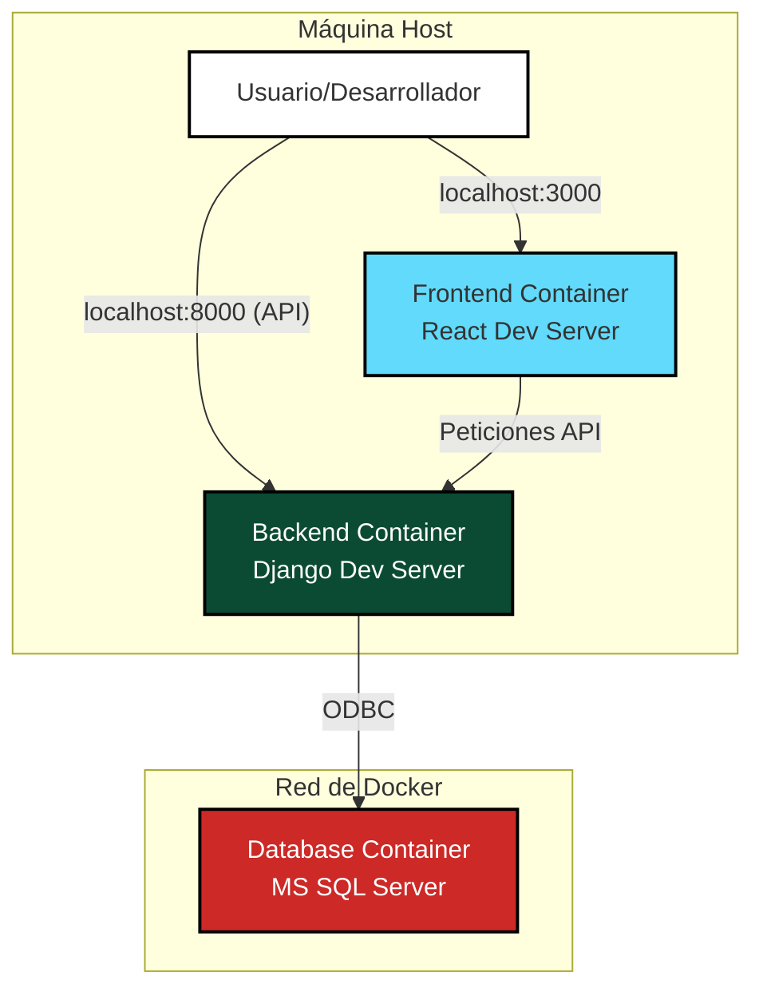
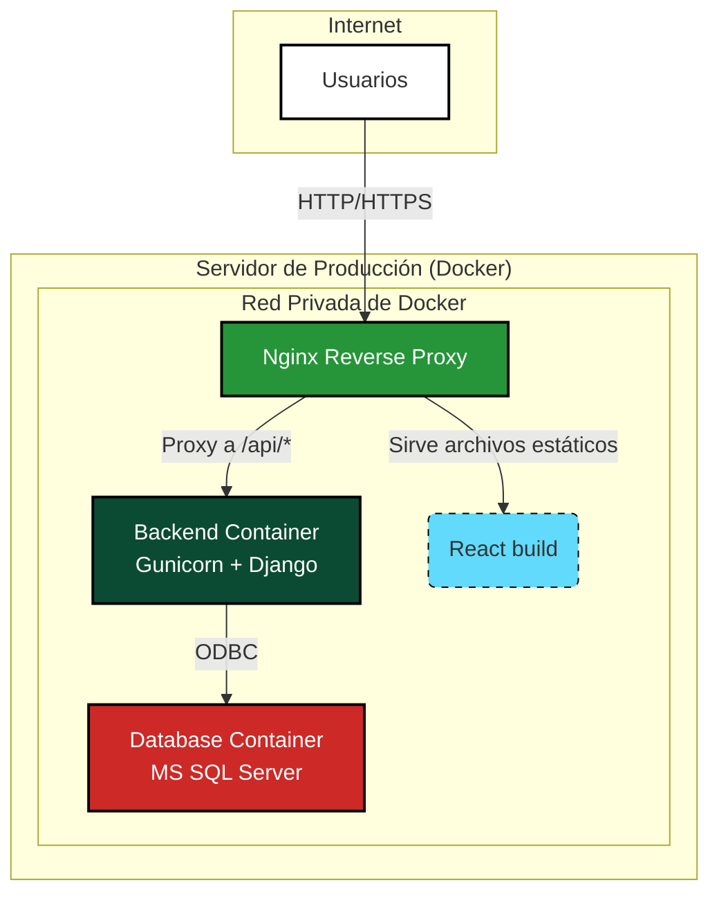

# Arquitectura del Sistema TexCore

Este documento describe la arquitectura de TexCore, tanto en su estado actual de desarrollo como en la arquitectura objetivo para producción.

---

## 1. Arquitectura de Desarrollo

El entorno de desarrollo actual está completamente contenerizado con Docker Compose, facilitando un levantamiento rápido y consistente del sistema en cualquier máquina.

### Componentes de Desarrollo:

-   **Frontend Container:**
    -   **Tecnología:** Node.js con `npm start` (Servidor de Desarrollo de React).
    -   **Función:** Sirve la aplicación de React con recarga en caliente para un desarrollo ágil.
    -   **Comunicación:** Se comunica con el backend a través de la red interna de Docker, llamando al servicio `backend` en el puerto 8000.

-   **Backend Container:**
    -   **Tecnología:** Python con `manage.py runserver` (Servidor de Desarrollo de Django).
    -   **Función:** Expone la API REST que gestiona toda la lógica de negocio.
    -   **Comunicación:** Se conecta a la base de datos a través del servicio `db` en el puerto 1433.

-   **Database Container:**
    -   **Tecnología:** Microsoft SQL Server para Linux.
    -   **Función:** Persiste todos los datos de la aplicación.

---

## 2. Arquitectura de Producción (Objetivo)

Para soportar una carga de usuarios real (~50 usuarios simultáneos) y garantizar la seguridad y eficiencia, el sistema evolucionará a la siguiente arquitectura de producción.

### Componentes de Producción:

-   **Nginx Reverse Proxy (Contenedor Principal):**
    -   **Función:** Es el **único punto de entrada** a la aplicación. Recibe todo el tráfico web.
    -   **Enrutamiento:**
        1.  Si una petición llega a la ruta `/api/...`, Nginx la redirige internamente al contenedor del `backend` (Gunicorn).
        2.  Para cualquier otra petición, Nginx sirve los archivos estáticos (HTML, CSS, JS) de la aplicación React, que habrán sido pre-compilados con `npm run build`.
    -   **Beneficios:** Balanceo de carga, seguridad (oculta los servicios internos), eficiencia en el servicio de archivos estáticos.

-   **Backend Container:**
    -   **Tecnología:** Python con **Gunicorn** como servidor de aplicaciones WSGI.
    -   **Función:** Ejecuta múltiples procesos de Django simultáneamente para atender varias peticiones de la API a la vez, a diferencia del `runserver` de desarrollo que solo maneja una.

-   **Database Container:**
    -   **Tecnología:** Microsoft SQL Server. Permanece igual que en desarrollo, pero se ejecutará en un hardware más potente y con monitoreo de recursos.