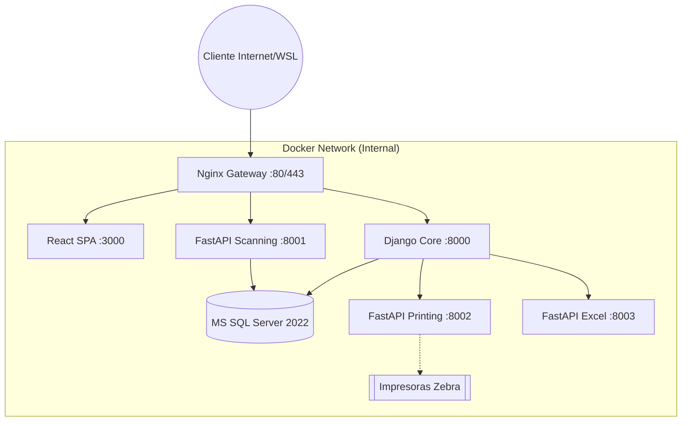
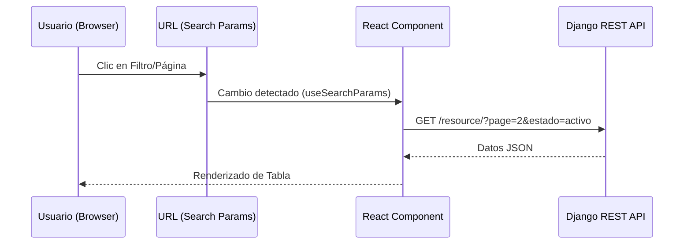
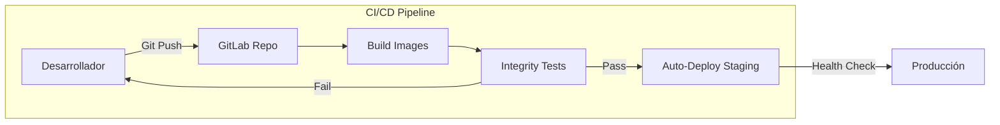
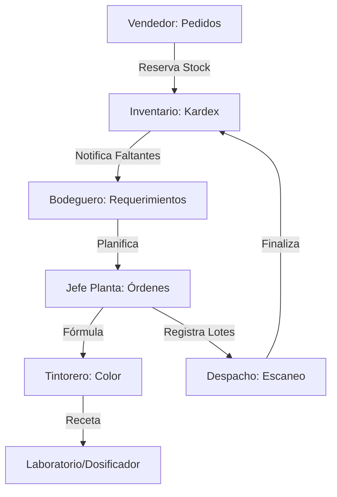

# Arquitectura y Estrategia de Desarrollo - TexCore

Este documento describe la arquitectura técnica de TexCore y los principios metodológicos seguidos en su desarrollo para garantizar un sistema escalable, mantenible y robusto.

---

## 🏗 Arquitectura del Sistema

TexCore utiliza una **arquitectura de microservicios pragmática**, centrada en una aplicación principal protegida por servicios especializados.

### Diagrama de Infraestructura Global (Contenedores)

### 1. Núcleo (Core Backend)
*   **Tecnología**: Python 3.12 + Django 5.1 + Django REST Framework (DRF).
*   **Base de Datos**: Microsoft SQL Server 2022.
*   **Responsabilidades**: Gestión del modelo relacional, reglas de negocio atómicas, control de acceso (RBAC) y auditoría global.
*   **Optimización**: Implementación de `select_related` y `prefetch_related` para reducir la complejidad de consultas de O(N) a O(1).

### 2. Microservicios Especializados
Desacoplan tareas de alta demanda de CPU o dependencias externas complejas:
*   **`scanning_service` (FastAPI)**: Validación de lotes en tiempo real para despacho, optimizado para latencia mínima.
*   **`printing_service` (FastAPI)**: Generación de documentos PDF (WeasyPrint) y etiquetas Zebra (ZPL).
*   **`reporting_excel` (FastAPI)**: Exportación de datos masivos a Excel utilizando Pandas, encapsulando las dependencias del driver de SQL Server.

### 3. Gateway e Infraestructura
*   **Nginx**: Actúa como **Reverse Proxy** y único punto de entrada, enrutando tráfico al frontend, backend o microservicios según el path.
*   **Docker Compose**: Orquestación de contenedores con redes aisladas para seguridad.

### Flujo de Navegación vs Datos (Arquitectura Híbrida)

---

## 💻 Desarrollo Moderno (Frontend)

El frontend de TexCore no es solo una interfaz estética, sino un motor de gestión de estado optimizado:

### 1. Tecnologías Clave
*   **Framework**: React 18 + TypeScript (Strict Mode).
*   **Build Tool**: Vite (para compilación instantánea y HMR).
*   **UI System**: TailwindCSS + Shadcn/UI (Componentes accesibles y personalizables).

### 2. Patrones de Diseño de UI
*   **Navegación Híbrida (URL State)**: El estado de búsqueda, filtros y paginación reside en la URL. Esto permite compartir enlaces exactos y mantener la consistencia al recargar.
*   **Composición de Componentes**: Uso intensivo de componentes compartidos (`DataTable`, `FormComponents`, `Layout`) para garantizar consistencia visual y de comportamiento.
*   **Validación Tipada**: Se utiliza **Zod** para validación de formularios en tiempo de ejecución, sincronizado con los tipos de TypeScript.

---

## 🛠 Proceso y Ciclo de Desarrollo

### Ciclo De Desarrollo y CI/CD

El sistema se desarrolla pensando en entornos mixtos:
*   **Linux/WSL2**: `./deploy.sh` automatiza el arranque.
*   **Windows (PowerShell)**: `./deploy.ps1` garantiza que la infraestructura Docker se levante con las configuraciones de red adecuadas para SQL Server local.

### 2. Calidad y Continuidad (CI/CD)
*   **Pipeline de GitLab**: En cada `push`, se ejecutan:
    1.  **Linter/Formatting**: Verificación de estilos.
    2.  **Tests Integrados**: Ejecución de la suite crítica de lógica de negocio (`gestion/tests_integrados.py`).
    3.  **Build de Contenedores**: Creación y subida de imágenes al Registry de GitLab.
    4.  **Auto-Deploy**: Despliegue en el entorno de Staging si las pruebas pasan.

### Integración de Módulos de Negocio

El desarrollo es iterativo y documentado:
*   [**ROADMAP.md**](../ROADMAP.md): Visión a mediano y largo plazo.
*   [**CHANGELOG.md**](../CHANGELOG.md): Registro histórico de mejoras y correcciones.
*   [**Manual de Roles**](GUIA_ROLES_SISTEMA.md): Fuente de verdad sobre el alcance operativo del sistema.

---

## 🔒 Capa de Seguridad (RBAC)

El sistema implementa un control de acceso por sede y rol:
1.  **Aislamiento de Sede**: Un usuario de la Sede "A" nunca verá datos de la Sede "B".
2.  **Jerarquía de Permisos**: Los usuarios de sistemas controlan maestros globales; los de sede, movimientos operativos; los operarios, su ejecución personal.
3.  **Audit Logs**: Cada creación o alteración de datos críticos deja una huella digital vinculada a la IP y usuario responsable.
