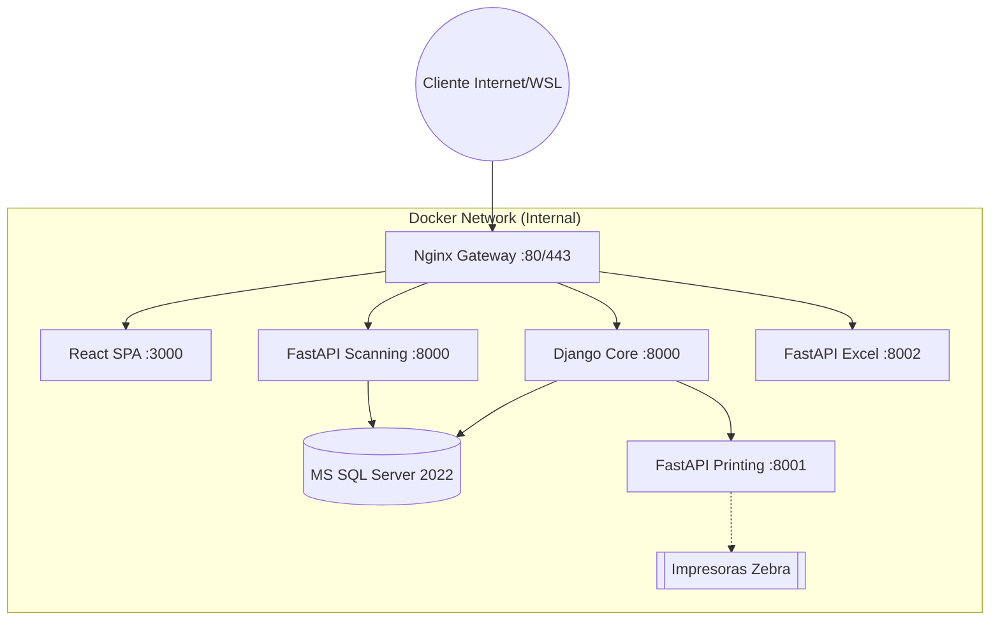
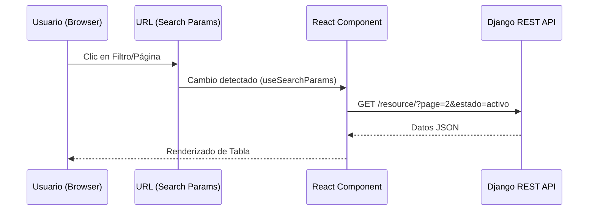
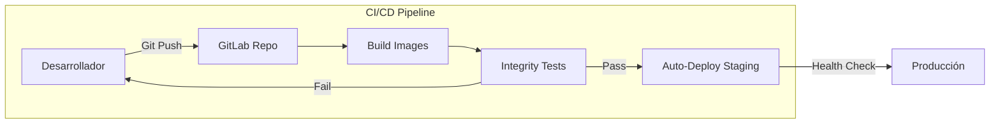
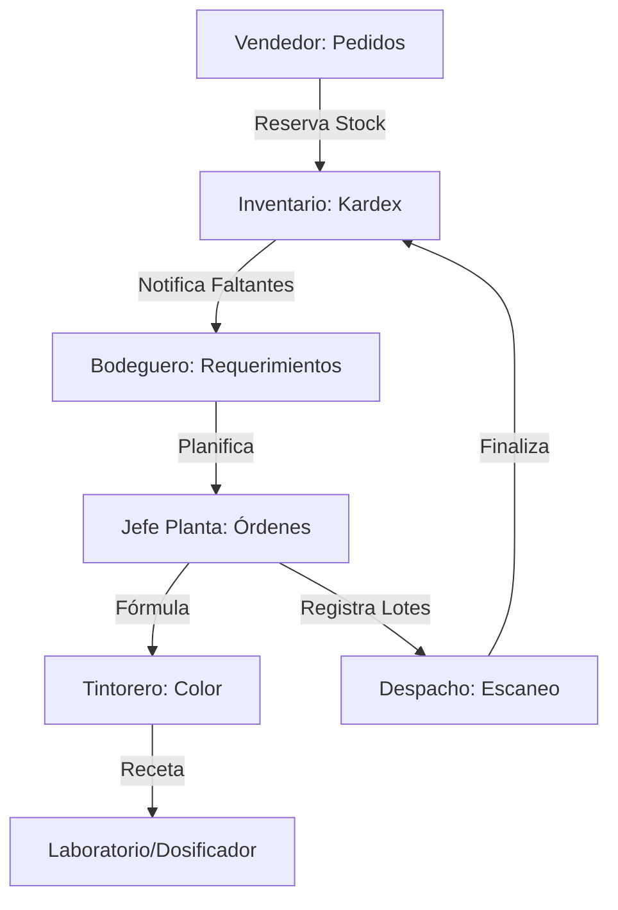
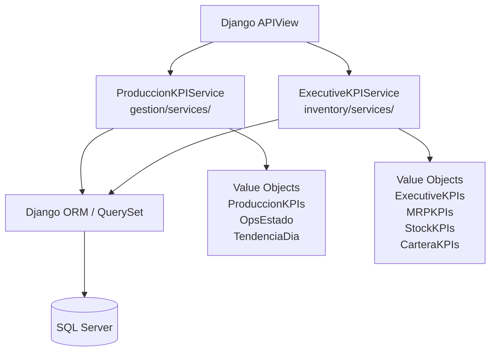
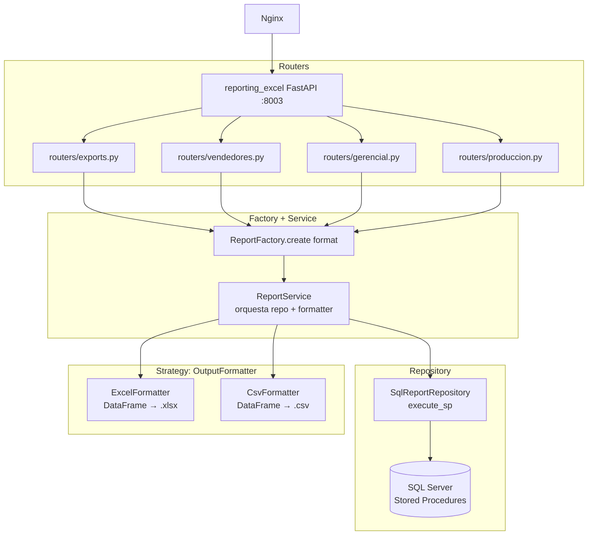

# Arquitectura y Estrategia de Desarrollo - TexCore

Este documento describe la arquitectura técnica de TexCore y los principios metodológicos seguidos en su desarrollo para garantizar un sistema escalable, mantenible y robusto.

---

## 🏗 Arquitectura del Sistema

TexCore utiliza una **arquitectura de microservicios pragmática**, centrada en una aplicación principal protegida por servicios especializados.

### Diagrama de Infraestructura Global (Contenedores)

```mermaid
graph TD
    Client((Cliente Internet/WSL)) --> Nginx[Nginx Gateway :80/443]
    
    subgraph "Docker Network (Internal)"
        Nginx --> Frontend[React SPA :3000]
        Nginx --> Backend[Django Core :8000]
        Nginx --> Scanning[FastAPI Scanning :8000]
        Nginx --> Excel[FastAPI Excel :8002]
        
        Backend --> SQL[(MS SQL Server 2022)]
        Scanning --> SQL
        
        Backend --> Printing[FastAPI Printing :8001]
        
        Printing -.-> Zebra[[Impresoras Zebra]]
    end
```

### 1. Núcleo (Core Backend)
*   **Tecnología**: Python 3.12 + Django 5.1 + Django REST Framework (DRF).
*   **Base de Datos**: Microsoft SQL Server 2022.
*   **Responsabilidades**: Gestión del modelo relacional, reglas de negocio atómicas, control de acceso (RBAC) y auditoría global.
*   **Optimización**: Implementación de `select_related` y `prefetch_related` para reducir la complejidad de consultas de O(N) a O(1).

### 2. Microservicios Especializados
Desacoplan tareas de alta demanda de CPU o dependencias externas complejas:
*   **`scanning_service` (FastAPI)**: Validación de lotes en tiempo real para despacho, optimizado para latencia mínima.
*   **`printing_service` (FastAPI)**: Generación de documentos PDF (WeasyPrint) y etiquetas Zebra (ZPL).
*   **`reporting_excel` (FastAPI)**: Exportación de datos masivos a Excel utilizando Pandas, encapsulando las dependencias del driver de SQL Server.

### 3. Gateway e Infraestructura
*   **Nginx**: Actúa como **Reverse Proxy** y único punto de entrada, enrutando tráfico al frontend, backend o microservicios según el path.
*   **Docker Compose**: Orquestación de contenedores con redes aisladas para seguridad.

### Flujo de Navegación vs Datos (Arquitectura Híbrida)

```mermaid
sequenceDiagram
    participant User as Usuario (Browser)
    participant URL as URL (Search Params)
    participant Component as React Component
    participant API as Django REST API

    User->>URL: Clic en Filtro/Página
    URL->>Component: Cambio detectado (useSearchParams)
    Component->>API: GET /resource/?page=2&estado=activo
    API-->>Component: Datos JSON
    Component-->>User: Renderizado de Tabla
```

---

## 💻 Desarrollo Moderno (Frontend)

El frontend de TexCore no es solo una interfaz estética, sino un motor de gestión de estado optimizado:

### 1. Tecnologías Clave
*   **Framework**: React 18 + TypeScript (Strict Mode).
*   **Build Tool**: Vite (para compilación instantánea y HMR).
*   **UI System**: TailwindCSS + Shadcn/UI (Componentes accesibles y personalizables).

### 2. Patrones de Diseño de UI
*   **Navegación Híbrida (URL State)**: El estado de búsqueda, filtros y paginación reside en la URL. Esto permite compartir enlaces exactos y mantener la consistencia al recargar.
*   **Composición de Componentes**: Uso intensivo de componentes compartidos (`DataTable`, `FormComponents`, `Layout`) para garantizar consistencia visual y de comportamiento.
*   **Validación Tipada**: Se utiliza **Zod** para validación de formularios en tiempo de ejecución, sincronizado con los tipos de TypeScript.

---

## 🛠 Proceso y Ciclo de Desarrollo

### Ciclo De Desarrollo y CI/CD

```mermaid
graph LR
    Dev[Desarrollador] -->|Git Push| GitLab[GitLab Repo]
    
    subgraph "CI/CD Pipeline"
        GitLab --> Build[Build Images]
        Build --> Test[Integrity Tests]
        Test -->|Fail| Dev
        Test -->|Pass| Deploy[Auto-Deploy Staging]
    end
    
    Deploy -->|Health Check| Prod[Producción]
```
El sistema se desarrolla pensando en entornos mixtos:
*   **Linux/WSL2**: `./deploy.sh` automatiza el arranque.
*   **Windows (PowerShell)**: `./deploy.ps1` garantiza que la infraestructura Docker se levante con las configuraciones de red adecuadas para SQL Server local.

### 2. Calidad y Continuidad (CI/CD)
*   **Pipeline de GitLab**: En cada `push`, se ejecutan:
    1.  **Linter/Formatting**: Verificación de estilos.
    2.  **Tests Integrados**: Ejecución de la suite crítica de lógica de negocio (`gestion/tests_integrados.py`).
    3.  **Build de Contenedores**: Creación y subida de imágenes al Registry de GitLab.
    4.  **Auto-Deploy**: Despliegue en el entorno de Staging si las pruebas pasan.

### Integración de Módulos de Negocio

```mermaid
graph TD
    Sales[Vendedor: Pedidos] -->|Reserva Stock| Inv[Inventario: Kardex]
    Inv -->|Notifica Faltantes| MRP[Bodeguero: Requerimientos]
    MRP -->|Planifica| Prod[Jefe Planta: Órdenes]
    Prod -->|Fórmula| Paint[Tintorero: Color]
    Paint -->|Receta| Lab[Laboratorio/Dosificador]
    Prod -->|Registra Lotes| Ship[Despacho: Escaneo]
    Ship -->|Finaliza| Inv
```

---

> **[Sprint 6 — 2026-04-10]**

### Service Layer (Capa de Servicios)

A partir del Sprint 6 se introduce una **capa de servicios** entre las vistas Django y el ORM, siguiendo el patrón de Value Objects con `dataclass(frozen=True)`:


```mermaid
graph TD
    View[Django APIView] --> SvcP[ProduccionKPIService\ngestion/services/]
    View --> SvcE[ExecutiveKPIService\ninventory/services/]
    SvcP --> ORM[Django ORM / QuerySet]
    SvcE --> ORM
    ORM --> DB[(SQL Server)]

    SvcP --> VP[Value Objects\nProduccionKPIs\nOpsEstado\nTendenciaDia]
    SvcE --> VE[Value Objects\nExecutiveKPIs\nMRPKPIs\nStockKPIs\nCarteraKPIs]
```

**Principios aplicados:**
- **SRP**: cada servicio encapsula un único dominio (producción vs. ejecutivo/cartera).
- **OCP**: nuevas métricas se añaden como Value Objects adicionales sin modificar vistas.
- **DIP**: las vistas dependen de contratos de servicio, no de querysets directos.
- **Inmutabilidad**: todos los Value Objects son `frozen=True`; cero efectos secundarios.

| Servicio | Módulo | Value Objects | Métodos |
|----------|--------|---------------|---------|
| `ProduccionKPIService` | `gestion/services/` | `ProduccionKPIs`, `OpsEstado`, `TendenciaDia` | `obtener_kpis()`, `obtener_tendencia()` |
| `ExecutiveKPIService` | `inventory/services/` | `ExecutiveKPIs`, `MRPKPIs`, `StockKPIs`, `CarteraKPIs` | `obtener_kpis()` |

### Microservicio `reporting_excel` — Componentes (refactorizado 2026-04-23)


```mermaid
graph TD
    Nginx --> RE[reporting_excel FastAPI :8003]

    subgraph Routers
        RE --> RK[routers/exports.py]
        RE --> RV[routers/vendedores.py]
        RE --> RG[routers/gerencial.py]
        RE --> RP[routers/produccion.py]
    end

    subgraph Factory["Factory + Service"]
        RK --> RF[ReportFactory.create format]
        RV --> RF
        RG --> RF
        RP --> RF
        RF --> RS[ReportService\norquesta repo + formatter]
    end

    subgraph Repository
        RS --> REPO[SqlReportRepository\nexecute_sp]
        REPO --> SP[(SQL Server\nStored Procedures)]
    end

    subgraph Formatters["Strategy: OutputFormatter"]
        RS --> EF[ExcelFormatter\nDataFrame → .xlsx]
        RS --> CF[CsvFormatter\nDataFrame → .csv]
    end
```

El desarrollo es iterativo y documentado:
*   [**ROADMAP.md**](../ROADMAP.md): Visión a mediano y largo plazo.
*   [**CHANGELOG.md**](../CHANGELOG.md): Registro histórico de mejoras y correcciones.
*   [**Manual de Roles**](GUIA_ROLES_SISTEMA.md): Fuente de verdad sobre el alcance operativo del sistema.

---

> **[Sprint 7 — 2026-04-23]**

### Refactorización SOLID de los 3 Microservicios FastAPI

Los microservicios `scanning_service`, `printing_service` y `reporting_excel` fueron refactorizados a arquitectura de capas siguiendo principios SOLID y patrones de diseño.

#### Principios aplicados por microservicio

| Principio | scanning_service | printing_service | reporting_excel |
|-----------|-----------------|-----------------|----------------|
| **SRP** | `LoteValidationService` concentra las 3 reglas de despacho; routers solo traducen HTTP | `DocumentService` concentra IVA/fechas; `NotaVentaRequest` es DTO puro | `ReportService` orquesta; `SqlReportRepository` solo ejecuta SPs |
| **OCP** | `ILoteRepository` Protocol — agregar fuente de datos sin tocar el servicio | `OutputStrategy` Protocol — agregar PNG/HTML sin tocar routers | `OutputFormatter` Protocol — agregar PDF/JSON sin tocar routers |
| **LSP** | Cualquier objeto que implemente `ILoteRepository` es sustituible en `LoteValidationService` | Cualquier `OutputStrategy` es sustituible en el router | Cualquier `OutputFormatter` es sustituible en `ReportService` |
| **ISP** | `ValidateRequest`, `LoteInfo`, `ValidateResponse` — un schema por caso de uso | `NotaVentaRequest` (entrada), `NotaVentaContexto` (template) — schemas separados | `KardexParams`, `RangoFechaParams`, `VendedorParams` — schemas por endpoint |
| **DIP** | `LoteValidationService` depende de `ILoteRepository` (Protocol), no de SQLAlchemy | Routers dependen de `OutputStrategy` Protocol; `Depends()` provee implementación concreta | `ReportService` depende de `IReportRepository` y `OutputFormatter` (Protocols) |

#### Patrones de diseño aplicados

| Patrón | Dónde | Por qué |
|--------|-------|---------|
| **Repository** | `scanning_service/repositories/` · `reporting_excel/repositories/` | Aisla el acceso a datos del dominio. Los tests inyectan un mock del repositorio sin parchear `sys.modules`. |
| **Strategy** | `printing_service/services/output_strategy.py` · `reporting_excel/formatters/` | Permite agregar un nuevo formato de salida (PDF, PNG, JSON) creando una nueva clase, sin modificar los routers existentes. |
| **Factory** | `reporting_excel/services/report_factory.py` | Centraliza la construcción del grafo de dependencias (`SqlReportRepository → ReportService → ExcelFormatter`). Los routers llaman `ReportFactory.create(format)` sin instanciar dependencias directamente. |

#### Estructura de capas resultante (patrón común)

```
microservicio/src/
  schemas/       ← DTOs Pydantic por caso de uso (ISP)
  repositories/  ← Protocol (base.py) + implementación concreta (sql_repository.py)
  services/      ← Lógica de negocio pura, depende de Protocols (DIP)
  formatters/    ← Strategy de formatos de salida (reporting_excel)
  routers/       ← Un archivo por caso de uso (SRP)
  main.py        ← App factory pura (solo include_router)
```

#### Impacto en testabilidad

| Antes | Después |
|-------|---------|
| `sys.modules` hack en `conftest.py` para evitar que `SessionLocal()` se ejecute al importar | `app.dependency_overrides` — limpio y estándar de FastAPI |
| Tests de integración dependen de `mock_db_connection` parchando rutas de módulo frágiles | Tests unitarios del servicio solo necesitan un `MagicMock()` que implemente el Protocol |
| Test `test_usuarios_export_empty` afirmaba `status_code == 404` (desincronizado del comportamiento real) | Corregido: afirma 200 con Excel descargable conteniendo fila de mensaje |

---

## 🔒 Capa de Seguridad (RBAC)

El sistema implementa un control de acceso por sede y rol:
1.  **Aislamiento de Sede**: Un usuario de la Sede "A" nunca verá datos de la Sede "B".
2.  **Jerarquía de Permisos**: Los usuarios de sistemas controlan maestros globales; los de sede, movimientos operativos; los operarios, su ejecución personal.
3.  **Audit Logs**: Cada creación o alteración de datos críticos deja una huella digital vinculada a la IP y usuario responsable.
