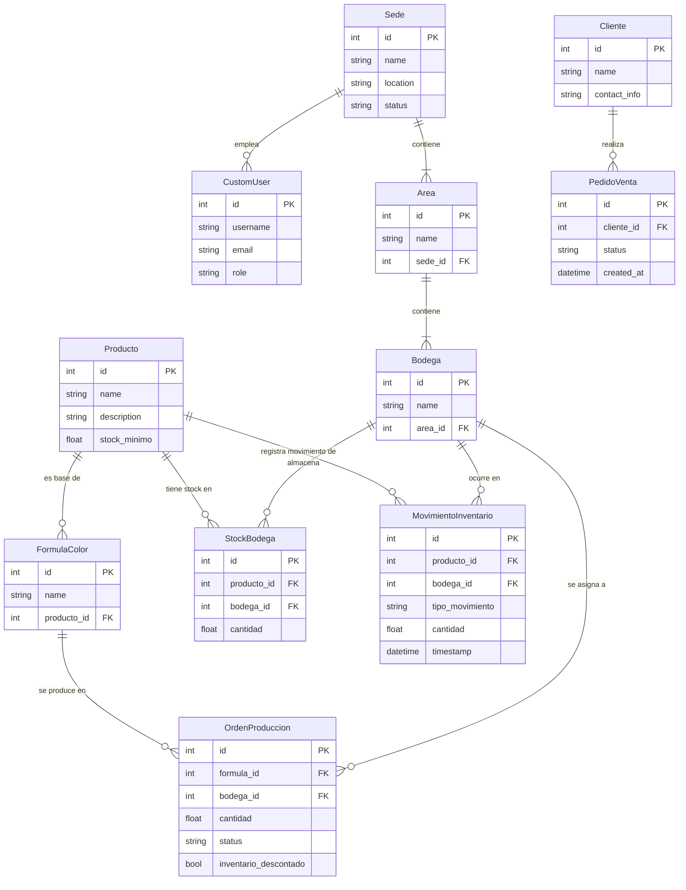

# Esquema de la Base de Datos

Este documento detalla la estructura de la base de datos y las relaciones entre las tablas principales.

## Diagrama Entidad-Relación (ERD)

## Descripción de Tablas Clave

-   **`gestion` (App Principal):**
    -   `CustomUser`: Almacena los usuarios y sus roles.
    -   `Sede`, `Area`, `Bodega`: Definen la estructura organizativa física.
    -   `Producto`: Catálogo de productos.
    -   `OrdenProduccion`: Órdenes para producir un producto a partir de una fórmula en una bodega específica.
    -   `PedidoVenta`: Pedidos de venta realizados por clientes.

-   **`inventory` (App de Inventario):**
    -   `StockBodega`: Tabla de resumen que muestra la cantidad actual (`stock`) de cada producto en cada bodega. Se actualiza con cada movimiento.
    -   `MovimientoInventario`: Actúa como un "Kardex", registrando cada entrada, salida, transferencia o ajuste de inventario. Proporciona un historial completo y trazabilidad.

## Relaciones Importantes

-   `StockBodega` y `MovimientoInventario` son el núcleo del sistema de inventario, conectando `Producto` y `Bodega` para dar una visión completa del stock.
-   `OrdenProduccion` conecta la producción (`FormulaColor`) con la logística (`Bodega`).
-   Las relaciones de `ForeignKey` en todo el esquema garantizan la integridad de los datos.
