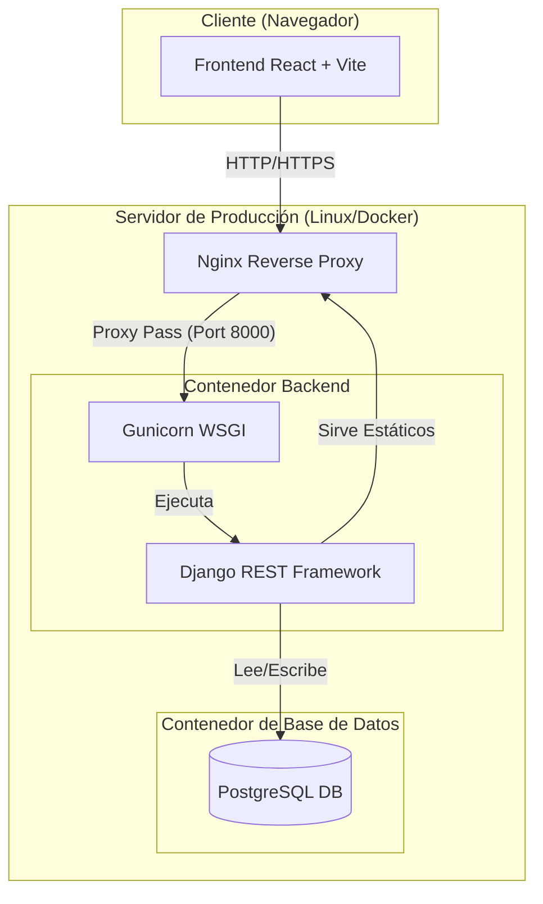

# Diagrama de Arquitectura - TexCore

```mermaid
graph TD
    subgraph "Cliente (Navegador)"
        UI[Frontend React + Vite]
    end

    subgraph "Servidor de Producción (Linux/Docker)"
        Nginx[Nginx Reverse Proxy]
        
        subgraph "Contenedor Backend"
            Django[Django REST Framework]
            Gunicorn[Gunicorn WSGI]
        end

        subgraph "Contenedor de Base de Datos"
            Postgres[(PostgreSQL DB)]
        end
    end

    UI -- HTTP/HTTPS --> Nginx
    Nginx -- Proxy Pass (Port 8000) --> Gunicorn
    Gunicorn -- Ejecuta --> Django
    Django -- Lee/Escribe --> Postgres
    Django -- Sirve Estáticos --> Nginx
```
