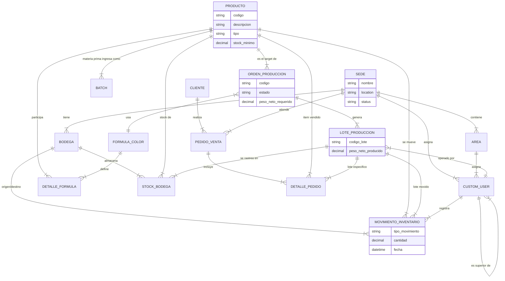

# Diagrama Entidad-Relación (ERD) - TexCore

```mermaid
erDiagram
    %% Gestión Core
    SEDE ||--|{ AREA : contiene
    SEDE ||--|{ BODEGA : tiene
    SEDE ||--|{ CUSTOM_USER : asigna
    AREA ||--|{ CUSTOM_USER : asigna

    %% Usuarios
    CUSTOM_USER ||--|{ CUSTOM_USER : "es superior de"

    %% Productos y Formulas
    PRODUCTO ||--|{ DETALLE_FORMULA : participa
    FORMULA_COLOR ||--|{ DETALLE_FORMULA : define
    PRODUCTO ||--|{ BATCH : "materia prima ingresa como"
    PRODUCTO ||--|{ ORDEN_PRODUCCION : "es el target de"
    
    %% Producción
    ORDEN_PRODUCCION }|--|| FORMULA_COLOR : usa
    ORDEN_PRODUCCION ||--|{ LOTE_PRODUCCION : genera
    LOTE_PRODUCCION }|--|| CUSTOM_USER : "operado por"

    %% Inventario
    BODEGA ||--|{ STOCK_BODEGA : almacena
    PRODUCTO ||--|{ STOCK_BODEGA : "stock de"
    LOTE_PRODUCCION ||--|{ STOCK_BODEGA : "se rastrea en"
    
    BODEGA ||--|{ MOVIMIENTO_INVENTARIO : "origen/destino"
    PRODUCTO ||--|{ MOVIMIENTO_INVENTARIO : "se mueve"
    LOTE_PRODUCCION ||--|{ MOVIMIENTO_INVENTARIO : "lote movido"
    CUSTOM_USER ||--|{ MOVIMIENTO_INVENTARIO : "registra"

    %% Ventas
    CLIENTE ||--|{ PEDIDO_VENTA : realiza
    PEDIDO_VENTA ||--|{ DETALLE_PEDIDO : incluye
    PRODUCTO ||--|{ DETALLE_PEDIDO : "item vendido"
    LOTE_PRODUCCION ||--|{ DETALLE_PEDIDO : "lote especifico"
    SEDE ||--|{ PEDIDO_VENTA : "atiende"

    %% Definiciones de Entidades Clave
    SEDE {
        string nombre
        string location
        string status
    }
    PRODUCTO {
        string codigo
        string descripcion
        string tipo
        decimal stock_minimo
    }
    ORDEN_PRODUCCION {
        string codigo
        string estado
        decimal peso_neto_requerido
    }
    LOTE_PRODUCCION {
        string codigo_lote
        decimal peso_neto_producido
    }
    MOVIMIENTO_INVENTARIO {
        string tipo_movimiento
        decimal cantidad
        datetime fecha
    }
```
