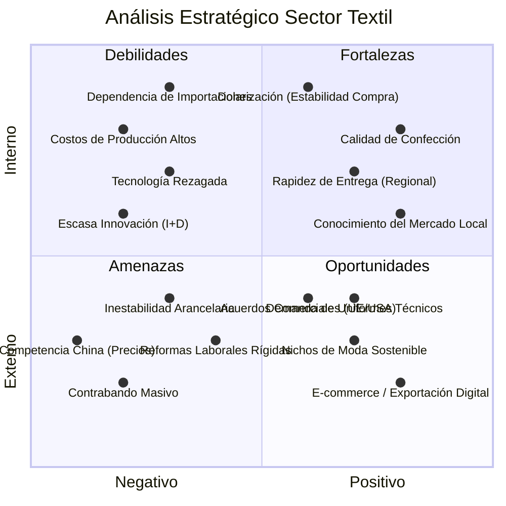

# Análisis FODA (SWOT) - Industria Textil Ecuatoriana

## Detalle del Análisis

### Fortalezas (Interno + Positivo)
- **Calidad de Confección**: Reconocimiento de buena mano de obra.
- **Rapidez de Respuesta**: Tiempos de entrega más cortos que Asia para el mercado local y andino.
- **Estabilidad Monetaria**: La dolarización facilita la planificación de compra de maquinaria e insumos.

### Debilidades (Interno + Negativo)
- **Altos Costos**: Mano de obra y energía costosa comparada con competidores regionales.
- **Tecnología**: Parque industrial con maquinaria antigua que reduce eficiencia.
- **Insumos**: Falta de producción local de fibras sintéticas y químicos especializados.

### Oportunidades (Externo + Positivo)
- **Nuevos Mercados**: Tendencia hacia el "Fast Fashion" regional y nichos sostenibles.
- **Canales Digitales**: Venta directa al consumidor final mediante plataformas web.
- **Contratación Pública**: Proveer uniformes y dotación al estado con preferencia a producción nacional.

### Amenazas (Externo + Negativo)
- **Contrabando**: Ingreso ilegal de mercadería sin pagar aranceles.
- **Competencia Global**: Productos asiáticos a precios inferiores al costo de materia prima local.
- **Entorno Legal**: Cambios constantes en leyes tributarias y laborales.
