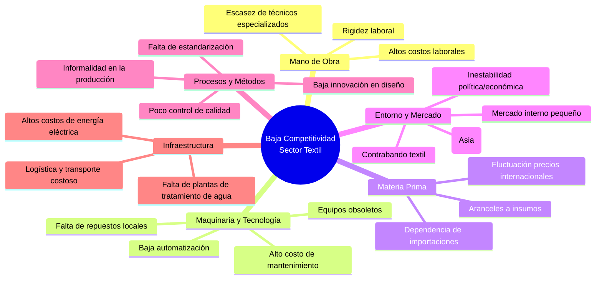

# Diagrama de Ishikawa - Industria Textil Ecuatoriana

Este diagrama analiza las causas raíz de la **Baja Competitividad en el Sector Textil**.

```mermaid
mindmap
  root((Baja Competitividad
  Sector Textil))
    Mano de Obra
      Altos costos laborales
      Rigidez laboral
      Escasez de técnicos especializados
    Maquinaria y Tecnología
      Equipos obsoletos
      Baja automatización
      Alto costo de mantenimiento
      Falta de repuestos locales
    Materia Prima
      Dependencia de importaciones
      Fluctuación precios internacionales
      Aranceles a insumos
    Entorno y Mercado
      Contrabando textil
      Competencia desleal (Asia)
      Mercado interno pequeño
      Inestabilidad política/económica
    Procesos y Métodos
      Falta de estandarización
      Poco control de calidad
      Baja innovación en diseño
      Informalidad en la producción
    Infraestructura
      Altos costos de energía eléctrica
      Logística y transporte costoso
      Falta de plantas de tratamiento de agua
```
