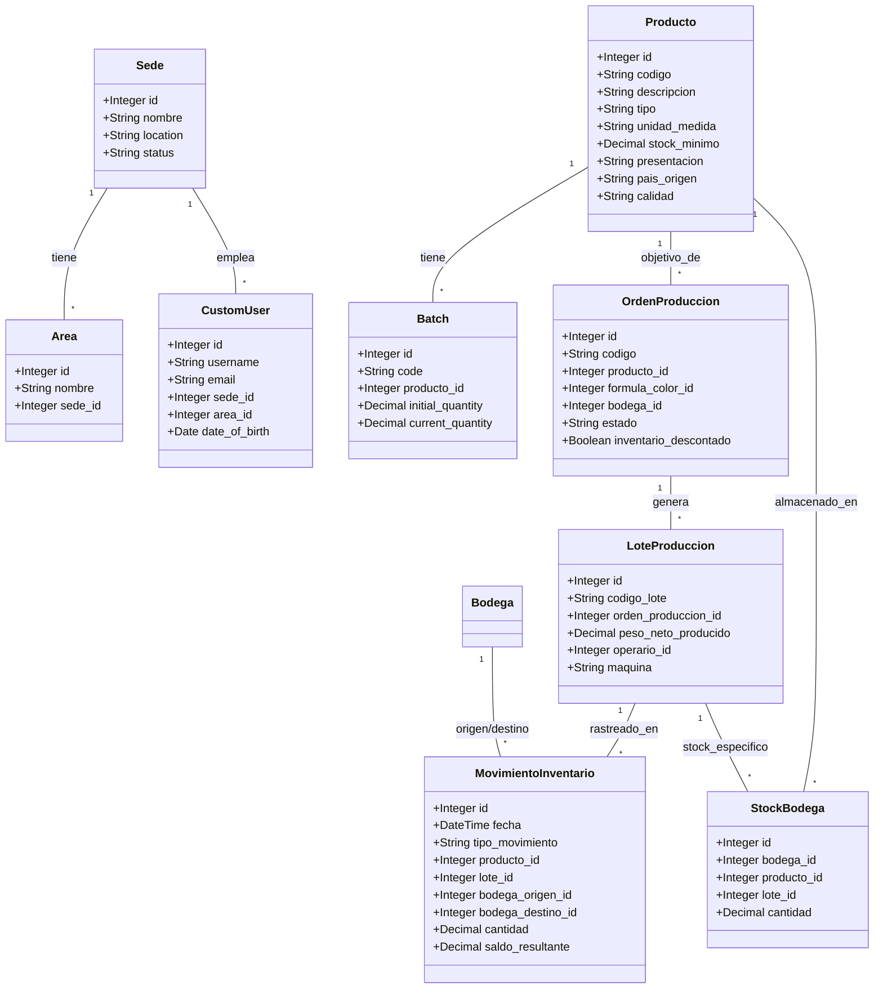

# Diagrama de Estructura de Base de Datos (Tablas)

```mermaid
classDiagram
    class Sede {
        +Integer id
        +String nombre
        +String location
        +String status
    }
    class Area {
        +Integer id
        +String nombre
        +Integer sede_id
    }
    class CustomUser {
        +Integer id
        +String username
        +String email
        +Integer sede_id
        +Integer area_id
        +Date date_of_birth
    }
    class Producto {
        +Integer id
        +String codigo
        +String descripcion
        +String tipo
        +String unidad_medida
        +Decimal stock_minimo
        +String presentacion
        +String pais_origen
        +String calidad
    }
    class Batch {
        +Integer id
        +String code
        +Integer producto_id
        +Decimal initial_quantity
        +Decimal current_quantity
    }
    class OrdenProduccion {
        +Integer id
        +String codigo
        +Integer producto_id
        +Integer formula_color_id
        +Integer bodega_id
        +String estado
        +Boolean inventario_descontado
    }
    class LoteProduccion {
        +Integer id
        +String codigo_lote
        +Integer orden_produccion_id
        +Decimal peso_neto_producido
        +Integer operario_id
        +String maquina
    }
    class MovimientoInventario {
        +Integer id
        +DateTime fecha
        +String tipo_movimiento
        +Integer producto_id
        +Integer lote_id
        +Integer bodega_origen_id
        +Integer bodega_destino_id
        +Decimal cantidad
        +Decimal saldo_resultante
    }
    class StockBodega {
        +Integer id
        +Integer bodega_id
        +Integer producto_id
        +Integer lote_id
        +Decimal cantidad
    }

    Sede "1" -- "*" Area : tiene
    Sede "1" -- "*" CustomUser : emplea
    Producto "1" -- "*" Batch : tiene
    Producto "1" -- "*" OrdenProduccion : objetivo_de
    OrdenProduccion "1" -- "*" LoteProduccion : genera
    LoteProduccion "1" -- "*" MovimientoInventario : rastreado_en
    Bodega "1" -- "*" MovimientoInventario : origen/destino
    Producto "1" -- "*" StockBodega : almacenado_en
    LoteProduccion "1" -- "*" StockBodega : stock_especifico
```
