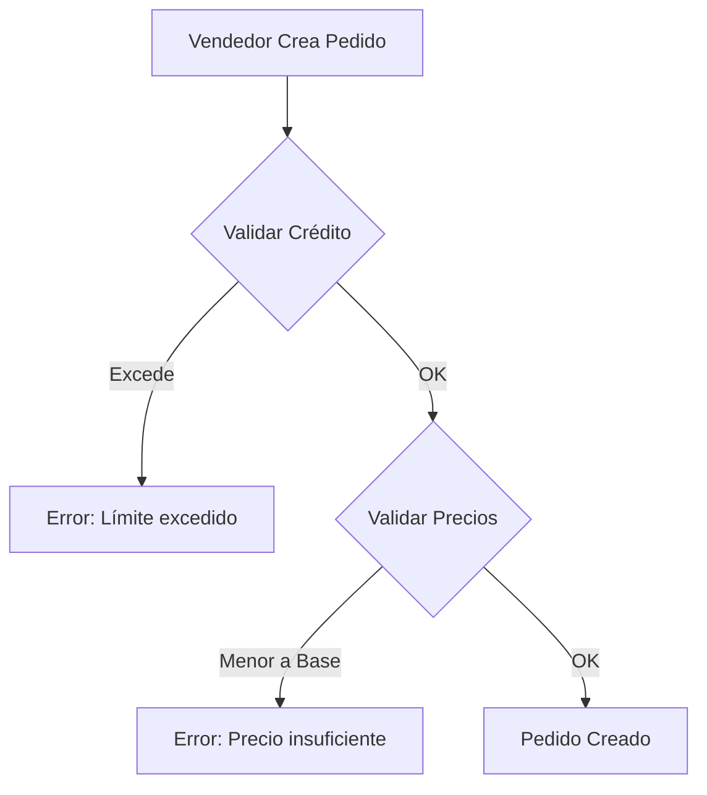
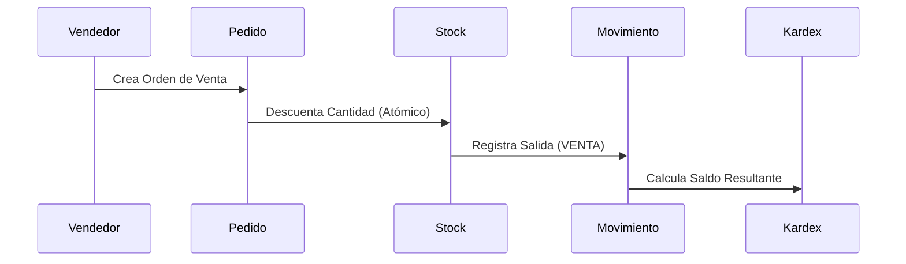

# Esquema de Base de Datos y Modelo de Negocio

Este documento detalla los modelos de datos de TexCore y las reglas de negocio críticas implementadas.

## 1. Aplicación: `gestion`

### `Sede`
Representa las sucursales físicas. Todo usuario (excepto admin_sistemas) debe estar asociado a una sede.

### `Cliente`
*   **limite_credito**: Límite máximo de deuda permitida.
*   **saldo_pendiente**: Propiedad dinámica calculada sumando los `DetallePedido` de órdenes no pagadas.
*   **vendedor_asignado**: Relación con el usuario responsable (Filtro de seguridad en API).
*   **tiene_beneficio**: Flag para descuentos especiales (Solo modificable por Vendedores/Admins).

### `PedidoVenta` y `DetallePedido`
*   **Validación de Crédito**: Al crear un pedido, se valida: `saldo_actual + total_nuevo <= limite_credito`.
*   **Validación de Precio**: No se permite un `precio_unitario` inferior al `precio_base` del producto asociado.

### `Producto`
*   **precio_base**: Costo mínimo de venta definido por la gerencia.
*   **tipo**: Categorías (hilo, tela, quimico).

## 2. Aplicación: `inventory`

### `StockBodega`
Saldo actual por bodega y lote. Soporta precisión decimal de 2 dígitos (ej. 0.33 kg) para trazabilidad exacta.

### `MovimientoInventario`
*   **Kardex**: Genera trazabilidad mediante el cálculo de `saldo_resultante` tras cada operación.
*   **Auditoría**: Los cambios en movimientos existentes quedan registrados en `AuditoriaMovimiento`.

## 3. Diagramas de Proceso

### Flujo de Venta vs Crédito

### Flujo Logístico (Kardex)

