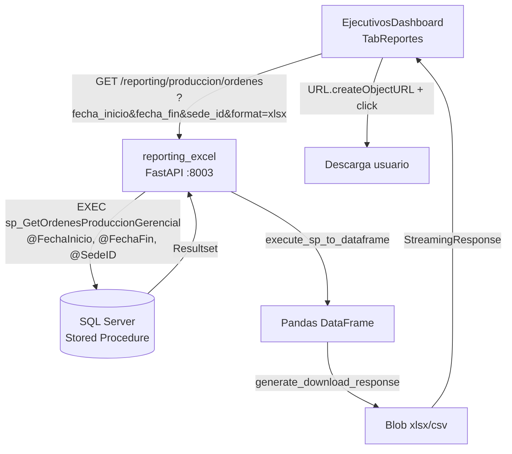
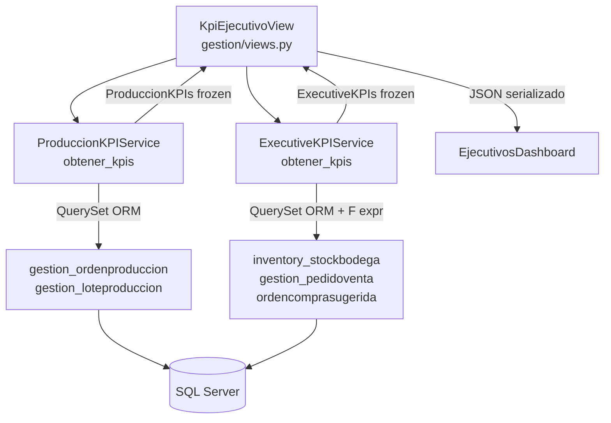
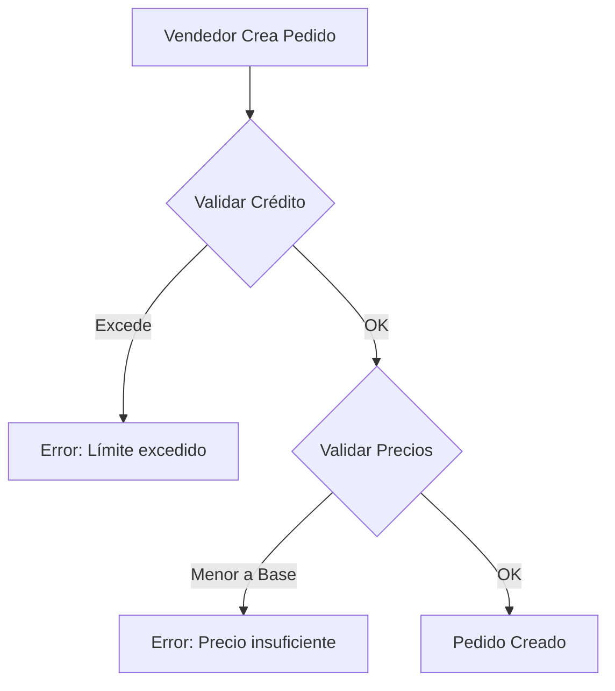
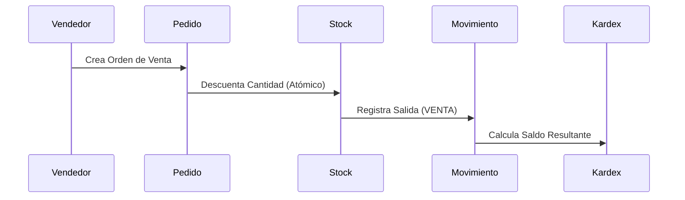

# Esquema de Base de Datos y Modelo de Negocio

Este documento detalla los modelos de datos de TexCore y las reglas de negocio críticas implementadas.

## 1. Aplicación: `gestion`

### `Sede`
Representa las sucursales físicas. Todo usuario (excepto admin_sistemas) debe estar asociado a una sede.

### `Cliente`
*   **limite_credito**: Límite máximo de deuda permitida.
*   **saldo_pendiente**: Propiedad dinámica calculada sumando los `DetallePedido` de órdenes no pagadas.
*   **vendedor_asignado**: Relación con el usuario responsable (Filtro de seguridad en API).
*   **tiene_beneficio**: Flag para descuentos especiales (Solo modificable por Vendedores/Admins).

### `PedidoVenta` y `DetallePedido`
*   **Validación de Crédito**: Al crear un pedido, se valida: `saldo_actual + total_nuevo <= limite_credito`.
*   **Validación de Precio**: No se permite un `precio_unitario` inferior al `precio_base` del producto asociado.

### `Producto`
*   **precio_base**: Costo mínimo de venta definido por la gerencia.
*   **tipo**: Categorías (hilo, tela, quimico, subproducto, insumo).
*   **unidad_medida**: Soporta `kg`, `metros` y `unidades`.

## 2. Aplicación: `inventory`

### `StockBodega`
Saldo actual por bodega y lote. Soporta precisión decimal de 2 dígitos (ej. 0.33 kg) para trazabilidad exacta.

### `MovimientoInventario`
*   **Kardex**: Genera trazabilidad mediante el cálculo de `saldo_resultante` tras cada operación.
*   **Auditoría**: Los cambios en movimientos existentes quedan registrados en `AuditLog`.
*   **Integración Logística**: El campo `documento_ref` vincula movimientos con Pedidos, Órdenes de Producción o Guías de Despacho.

## 3. Aplicación: `production` y `tintura`

### `OrdenProduccion` (OP)
*   **Ciclo de Vida**: Pendiente -> En Proceso -> Finalizada.
*   **Asignación Atómica**: Vincula Producto, Fórmula de Color, Máquina y Operario.
*   **Peso Neto Requerido**: Meta de producción que dispara el cierre automático al alcanzarse.

### `LoteProduccion`
*   Registro granular de cada unidad producida (bobina/rollo).
*   Descuenta materias primas del inventario (teórico) basándose en la fórmula vinculada.

### `FormulaColor` y `FaseReceta`
*   Estructura jerárquica: Fórmula -> Fases -> Detalles (Químicos).
*   **Tipo Sustrato**: Algodón, Poliéster, Nylon, Mixto.
*   **Versión**: Control de cambios en recetas de laboratorio.

## 4. Gestión de Despacho y Microservicios

### `HistorialDespacho`
*   Maestro de salida física que agrupa múltiples pedidos.
*   Calcula peso total real despachado vs teórico.

### `RequerimientoMaterial` (MRP)
*   Cálculo dinámico de faltantes: `Existencia - (Pedidos Pendientes + OPs en Proceso)`.
*   Genera `OrdenCompraSugerida` para reabastecimiento proactivo.

> **[Sprint 6 — 2026-04-10]**

## 3. Stored Procedures de Reportes de Producción

Creados en la migración `inventory/migrations/0020_produccion_reporting_sps.py`. Se usan exclusivamente desde el microservicio `reporting_excel` vía `execute_sp_to_dataframe()`.

| SP | Parámetros | Descripción |
|----|-----------|-------------|
| `sp_GetOrdenesProduccionGerencial` | `@FechaInicio DATE`, `@FechaFin DATE`, `@SedeID INT = NULL` | Detalle de OPs con producto, fórmula de color, sede, área, máquina, operario y avance (%). Incluye OPs sin lotes aún. |
| `sp_GetLotesProduccionGerencial` | `@FechaInicio DATE`, `@FechaFin DATE`, `@SedeID INT = NULL` | Lotes del período con `peso_bruto`, `tara`, `peso_neto`, `kg_por_hora` calculado, y duración en minutos. |
| `sp_GetTendenciaProduccionGerencial` | `@FechaInicio DATE`, `@FechaFin DATE`, `@SedeID INT = NULL` | Serie temporal diaria de kg producidos. Usa CTE `Calendario` para garantizar continuidad (días sin producción = 0). `OPTION(MAXRECURSION 365)`. |

**Nota**: `@SedeID = NULL` equivale a vista global (todas las sedes). El parámetro es nullable en todos los SPs.

### Flujo de datos: Service Layer → Reporting Excel

```mermaid
graph TD
    FE[EjecutivosDashboard\nTabReportes] -->|GET /reporting/produccion/ordenes\n?fecha_inicio&fecha_fin&sede_id&format=xlsx| RE[reporting_excel\nFastAPI :8003]
    RE -->|EXEC sp_GetOrdenesProduccionGerencial\n@FechaInicio, @FechaFin, @SedeID| SP[(SQL Server\nStored Procedure)]
    SP -->|Resultset| RE
    RE -->|execute_sp_to_dataframe| PD[Pandas DataFrame]
    PD -->|generate_download_response| BLOB[Blob xlsx/csv]
    BLOB -->|StreamingResponse| FE
    FE -->|URL.createObjectURL + click| User[Descarga usuario]
```

### Flujo de datos: KPI Ejecutivo (Service Layer)

```mermaid
graph TD
    View[KpiEjecutivoView\ngestion/views.py] --> SvcP[ProduccionKPIService\nobtener_kpis]
    View --> SvcE[ExecutiveKPIService\nobtener_kpis]
    SvcP -->|QuerySet ORM| OP[gestion_ordenproduccion\ngestion_loteproduccion]
    SvcE -->|QuerySet ORM + F expr| INV[inventory_stockbodega\ngestion_pedidoventa\nordencomprasugerida]
    OP --> DB[(SQL Server)]
    INV --> DB
    SvcP -->|ProduccionKPIs frozen| View
    SvcE -->|ExecutiveKPIs frozen| View
    View -->|JSON serializado| FE[EjecutivosDashboard]
```

## 4. Diagramas de Proceso

### Flujo de Venta vs Crédito

```mermaid
graph TD
    A[Vendedor Crea Pedido] --> B{Validar Crédito}
    B -- Excede --> C[Error: Límite excedido]
    B -- OK --> D{Validar Precios}
    D -- Menor a Base --> E[Error: Precio insuficiente]
    D -- OK --> F[Pedido Creado]
```

### Flujo Logístico (Kardex)

```mermaid
sequenceDiagram
    Vendedor->>Pedido: Crea Orden de Venta
    Pedido->>Stock: Descuenta Cantidad (Atómico)
    Stock->>Movimiento: Registra Salida (VENTA)
    Movimiento->>Kardex: Calcula Saldo Resultante
```
