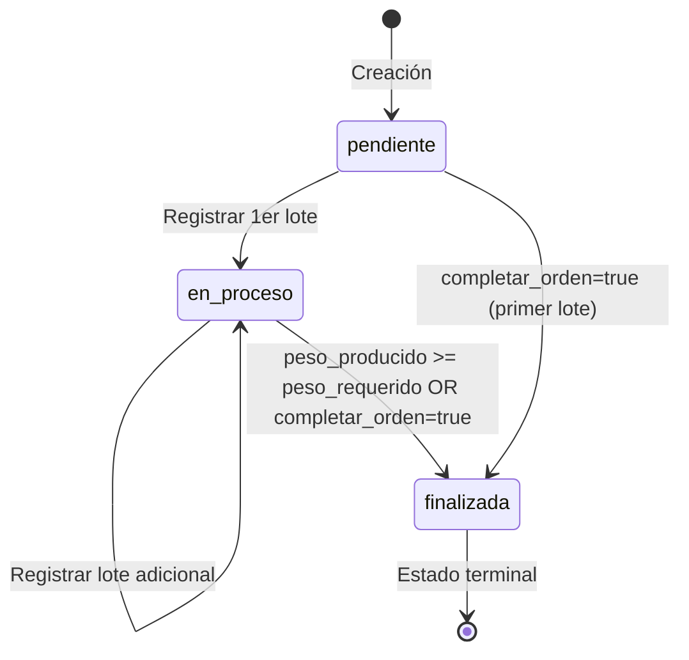
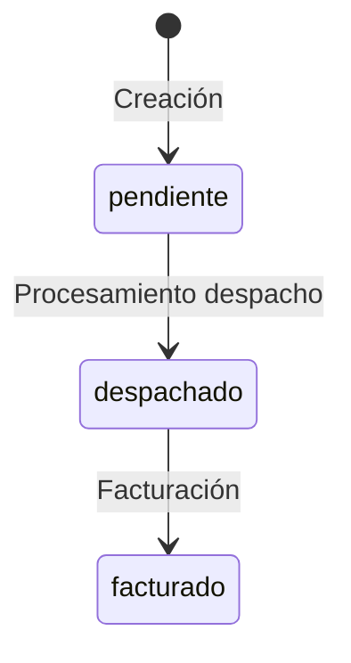

# 🧪 Plan de Pruebas Técnico — TexCore ERP

**Autor**: Senior SDET / QA Lead (ISTQB)
**Fecha**: 2026-03-24
**Proyecto**: TexCore — ERP Textil
**Stack**: Django (Backend) · React (Frontend) · SQL Server (Persistencia)

---

## 1. Análisis de Lógica de Negocio

### 1.1 Reglas de Negocio Identificadas

| # | Módulo | Regla | Archivo fuente |
|---|--------|-------|----------------|
| RN-01 | Auditoría | Todo modelo `AuditableModelMixin` registra CREATE/UPDATE/DELETE en `AuditLog` con IP, usuario y justificación | [models.py](file:///home/Adminbrandon/Documentos/Proyectos/gestion/models.py#L42-L151) |
| RN-02 | Auditoría | Los modelos con `requiere_justificacion_auditoria=True` exigen `_justificacion_auditoria` en UPDATE/DELETE | [models.py](file:///home/Adminbrandon/Documentos/Proyectos/gestion/models.py#L75-L86) |
| RN-03 | Multi-tenancy | Los usuarios no-admin solo ven registros de su propia sede; superusuarios/admin_sistemas/ejecutivo ven todas | Múltiples ViewSets |
| RN-04 | Roles | 10 roles: admin_sistemas, admin_sede, ejecutivo, jefe_planta, jefe_area, tintorero, operario, bodeguero, despacho, vendedor | [permissions.py](file:///home/Adminbrandon/Documentos/Proyectos/gestion/permissions.py) |
| RN-05 | Vendedor | Solo ve productos tipo hilo/tela/subproducto; no químicos ni insumos | [views.py](file:///home/Adminbrandon/Documentos/Proyectos/gestion/views.py#L275-L276) |
| RN-06 | Cliente - Crédito | `saldo_proyectado > limite_credito` → bloqueo de nuevo pedido | [serializers.py](file:///home/Adminbrandon/Documentos/Proyectos/gestion/serializers.py#L709-L712) |
| RN-07 | Cliente - Vencido | Si existe cartera vencida → **bloqueo total** de nuevos pedidos | [serializers.py](file:///home/Adminbrandon/Documentos/Proyectos/gestion/serializers.py#L716-L725) |
| RN-08 | Cliente - Contado | Clientes con `plazo_credito_dias=0` no pueden tener >1 pedido impago | [serializers.py](file:///home/Adminbrandon/Documentos/Proyectos/gestion/serializers.py#L728-L733) |
| RN-09 | Detalle Pedido | `precio_unitario >= producto.precio_base` (no vender bajo costo) | [serializers.py](file:///home/Adminbrandon/Documentos/Proyectos/gestion/serializers.py#L459-L462) |
| RN-10 | Detalle Pedido | `subtotal = peso × precio_unitario`; `total_con_iva = subtotal × 1.15` si IVA | [models.py](file:///home/Adminbrandon/Documentos/Proyectos/gestion/models.py#L610-L614) |
| RN-11 | Producción | Transición estados OP: pendiente → en_proceso → finalizada (irreversible) | [serializers.py](file:///home/Adminbrandon/Documentos/Proyectos/gestion/serializers.py#L581-L588) |
| RN-12 | Empaquetado | Presentaciones: Baño=225 conos, Funda=15 conos, Cono=1 | [models.py](file:///home/Adminbrandon/Documentos/Proyectos/gestion/models.py#L528-L540) |
| RN-13 | Empaquetado | Peso bruto > tara (validación estricta); alerta si neto difiere >5% del requerido | [serializers.py](file:///home/Adminbrandon/Documentos/Proyectos/gestion/serializers.py#L636-L662) |
| RN-14 | Inventario | Compra/Producción → suma stock; Venta/Consumo → resta stock; Transferencia → atómica entre bodegas | [views.py](file:///home/Adminbrandon/Documentos/Proyectos/inventory/views.py#L128-L152) |
| RN-15 | Inventario | Salida rechazada si `stock < cantidad`; CheckConstraint `saldo_resultante >= 0` | [models.py](file:///home/Adminbrandon/Documentos/Proyectos/inventory/models.py#L88-L96) |
| RN-16 | Transferencia | `bodega_origen ≠ bodega_destino` | [serializers.py](file:///home/Adminbrandon/Documentos/Proyectos/inventory/serializers.py#L64-L69) |
| RN-17 | Edición Movimiento | Solo movimientos tipo COMPRA son editables; requiere razón ≥10 caracteres | [views.py](file:///home/Adminbrandon/Documentos/Proyectos/inventory/views.py#L194-L198) |
| RN-18 | Despacho | Escaneo de lote: valida existencia + stock > 0; descuenta todo el lote | [views.py](file:///home/Adminbrandon/Documentos/Proyectos/inventory/views.py#L608-L654) |
| RN-19 | Pagos | Reconciliación FIFO: pagos se aplican a pedidos en orden cronológico | [utils.py](file:///home/Adminbrandon/Documentos/Proyectos/gestion/utils.py#L47-L99) |
| RN-20 | Fórmulas | Duplicar formula: incrementa versión, copia fases+detalles, estado='en_pruebas' | [views.py](file:///home/Adminbrandon/Documentos/Proyectos/gestion/views.py#L447-L501) |
| RN-21 | Fórmulas | No se permiten insumos (productos) duplicados en la misma fórmula | [serializers.py](file:///home/Adminbrandon/Documentos/Proyectos/gestion/serializers.py#L364-L374) |
| RN-22 | Dosificación | Cálculo gr/L: `cantidad_gr = volumen_L × concentración`; Cálculo %: `cantidad_kg = (kg_tela × %) / 100` | [services_formula.py](file:///home/Adminbrandon/Documentos/Proyectos/gestion/services_formula.py#L42-L81) |
| RN-23 | MRP | Limpia requerimientos previos; calcula necesidades de pedidos y OPs; genera OCs sugeridas si `requerido > stock` | [mrp_engine.py](file:///home/Adminbrandon/Documentos/Proyectos/inventory/services/mrp_engine.py#L20-L147) |
| RN-24 | Máquinas | Estados: operativa / mantenimiento / inactiva; eficiencia = producción / capacidad_maxima × 100 | [models.py](file:///home/Adminbrandon/Documentos/Proyectos/gestion/models.py#L220-L234) |
| RN-25 | Registro Lote | Al registrar lote: consume materia prima, consume insumos de empaquetado, crea stock de salida, actualiza estado de la OP | [views.py](file:///home/Adminbrandon/Documentos/Proyectos/gestion/views.py#L1023-L1135) |

### 1.2 Validaciones Identificadas

| Validación | Campo/Modelo | Tipo |
|-----------|-------------|------|
| `limite_credito >= 0` | `Cliente` | CheckConstraint DB |
| `peso_neto_producido >= 0` | `LoteProduccion` | CheckConstraint DB |
| `peso_bruto >= 0` | `LoteProduccion` | CheckConstraint DB |
| `tara >= 0` | `LoteProduccion` | CheckConstraint DB |
| `cantidad >= 0` | `DetallePedido` | CheckConstraint DB |
| `precio_unitario >= 0` | `DetallePedido` | CheckConstraint DB |
| `cantidad >= 0` | `MovimientoInventario` | CheckConstraint DB |
| `saldo_resultante >= 0` | `MovimientoInventario` | CheckConstraint DB |
| `kg_tela > 0` | `DosificacionSerializer` | Serializer |
| `relacion_bano > 0` | `DosificacionSerializer` | Serializer |
| `peso_neto_producido > 0` | `RegistrarLoteProduccionSerializer` | Serializer |
| `nombre` solo alfanumérico+acentos | `Area`, `CustomUser.first/last_name` | Regex |
| Sede requerida para no-admin_sistemas | `CustomUserSerializer.validate` | Cross-field |
| Unique: `(bodega, producto)` sin lote | `StockBodega` | UniqueConstraint |
| Unique: `(bodega, producto, lote)` con lote | `StockBodega` | UniqueConstraint |
| Unique: `(fase, producto)` en DetalleFormula | `DetalleFormula` | unique_together |

---

## 2. Pruebas de Caja Negra (Diseño ISTQB)

### 2.1 Partición de Equivalencia

#### Módulo: Gestión de Clientes y Crédito

| Grupo | Clase | Valores Ejemplo | Resultado Esperado |
|-------|-------|-----------------|-------------------|
| Límite de crédito | Válido: `>= 0` | 0, 500, 10000 | Acepta |
| Límite de crédito | Inválido: `< 0` | -1, -0.001 | Rechaza (CheckConstraint) |
| Plazo crédito | Contado: `0` | 0 | Un solo pedido impago |
| Plazo crédito | Crédito: `> 0` | 15, 30, 45, 60, 90 | Múltiples pedidos hasta límite |
| RUC/Cédula | Válido: único | "1700000001" | Acepta |
| RUC/Cédula | Duplicado | RUC ya existente | Rechaza (unique) |
| Nivel Precio | Válido | "mayorista", "normal" | Acepta |
| Nivel Precio | Inválido | "vip", "", null | Rechaza |
| Saldo+Nuevo > Límite | Bloqueo crédito | saldo=$800 + nuevo=$300 > límite=$1000 | Error 400 |
| Saldo+Nuevo <= Límite | Permite | saldo=$500 + nuevo=$400 <= límite=$1000 | Acepta |

#### Módulo: Inventario

| Grupo | Clase | Valores | Resultado |
|-------|-------|---------|-----------|
| Tipo Movimiento Entrada | Válido | COMPRA, PRODUCCION, AJUSTE, DEVOLUCION | Stock incrementa |
| Tipo Movimiento Salida | Válido | VENTA, CONSUMO, AJUSTE_NEGATIVO | Stock decrementa |
| Tipo Movimiento | Inválido | "REGALO", "" | Rechaza |
| Cantidad | Válido: `> 0` | 0.01, 100, 9999.99 | Acepta |
| Cantidad | Inválido: `<= 0` | 0, -5 | Rechaza |
| Cantidad salida | `<= stock` | Disponible=50, solicita=50 | Acepta |
| Cantidad salida | `> stock` | Disponible=50, solicita=51 | Error: stock insuficiente |

#### Módulo: Dosificación

| Grupo | Clase | Valores | Resultado |
|-------|-------|---------|-----------|
| kg_tela | Válido: `> 0` | 0.001, 50, 500 | Calcula correctamente |
| kg_tela | Inválido: `<= 0` | 0, -10 | Error validación |
| relacion_bano | Válido: `> 0` | 1, 10, 20 | Calcula volumen = kg × relación |
| tipo_calculo | gr/L | concentración=2.5 | `cantidad_gr = vol × 2.5` |
| tipo_calculo | pct | porcentaje=3.0 | `cantidad_kg = (kg × 3) / 100` |

### 2.2 Análisis de Valores Límite (BVA)

| ID | Módulo | Punto Crítico | Valor Límite Inferior | Valor en Frontera | Valor Límite Superior |
|----|--------|--------------|----------------------|-------------------|----------------------|
| BVA-01 | Cliente | Límite crédito | -0.001 (inválido) | 0 (válido) | 0.001 (válido) |
| BVA-02 | Inventario | Stock a cero | Salida: stock=0.01, sale=0.01 → OK | stock=0, sale=0.01 → Error | stock=0.01, sale=0.02 → Error |
| BVA-03 | Transferencia | Cantidad mínima | 0 (inválido) | 0.01 (mínimo válido) | 0.02 (válido) |
| BVA-04 | Pedido | Precio vs costo base | precio < base (error) | precio = base (OK) | precio > base (OK) |
| BVA-05 | Empaquetado | Tara vs Bruto | tara = bruto (error) | tara = bruto - 0.001 (OK) | tara > bruto (error) |
| BVA-06 | Edición Mov | Razón de cambio min | 9 chars (error) | 10 chars (OK) | 11 chars (OK) |
| BVA-07 | Maquina | Eficiencia ideal | -0.01 (inválido) | 0.00 (válido) | 1.00 (máx válido) |
| BVA-08 | Producción | Peso neto producido | 0 (inválido) | 0.01 (válido) | 9999999.99 (máx) |
| BVA-09 | MRP | Stock vs Requerido | stock=requerido (sin OC) | stock=req-0.001 (genera OC) | stock>req (sin OC) |
| BVA-10 | DetallePedido | Cantidad | -1 (inválido DB) | 0 (frontera) | 1 (válido) |

### 2.3 Tablas de Transición de Estados

#### Orden de Producción

| Estado Actual | Evento | Estado Siguiente | Válido |
|--------------|--------|-----------------|--------|
| pendiente | Registrar lote (parcial) | en_proceso | ✅ |
| pendiente | Registrar lote (completa orden) | finalizada | ✅ |
| en_proceso | Registrar lote (parcial) | en_proceso | ✅ |
| en_proceso | Registrar lote (peso >= requerido) | finalizada | ✅ |
| en_proceso | completar_orden=true | finalizada | ✅ |
| **finalizada** | **Cambiar a pendiente/en_proceso** | **— (rechazado)** | ❌ |
| **finalizada** | **Cambiar a en_proceso** | **— (rechazado)** | ❌ |

#### Pedido de Venta

| Estado Actual | Evento | Estado Siguiente | Válido |
|--------------|--------|-----------------|--------|
| pendiente | Despacho | despachado | ✅ |
| despachado | Facturación | facturado | ✅ |
| pendiente | Facturación (sin despacho) | — | ⚠️ No validado explícitamente |

#### Fórmula de Color

| Estado Actual | Evento | Estado Siguiente | Válido |
|--------------|--------|-----------------|--------|
| en_pruebas | Aprobación | aprobada | ✅ |
| aprobada | Duplicar | en_pruebas (nueva versión) | ✅ |
| en_pruebas | Duplicar | en_pruebas (nueva versión) | ✅ |

#### Orden de Compra Sugerida (MRP)

| Estado Actual | Evento | Estado Siguiente | Válido |
|--------------|--------|-----------------|--------|
| PENDIENTE | Aprobar | APROBADA | ✅ |
| PENDIENTE | Rechazar | RECHAZADA | ✅ |
| PENDIENTE | Re-ejecutar MRP | Eliminada y recalculada | ✅ |
| APROBADA | Re-ejecutar MRP | Se mantiene | ✅ |

#### Máquina

| Estado Actual | Evento | Estado Siguiente |
|--------------|--------|-----------------|
| operativa | Mantenimiento programado | mantenimiento |
| operativa | Desactivar | inactiva |
| mantenimiento | Reparación completa | operativa |
| mantenimiento | Desactivar | inactiva |
| inactiva | Reactivar | operativa |

---

## 3. Pruebas de Caja Blanca (Cobertura de Decisiones)

| ID | Ruta / Decisión | Condición | Caso True | Caso False |
|----|----------------|-----------|-----------|------------|
| CW-01 | `AuditableModelMixin.save()` L72 | `self.pk is None` | CREATE log | UPDATE log |
| CW-02 | `AuditableModelMixin.save()` L76 | `not is_new and requiere_justificacion and not justificacion` → chequear si cambió campos | Si cambió y no hay justificación → ValidationError | Si no cambió → pasa sin error |
| CW-03 | `LoteProduccion.clean()` L529 | `self.presentacion` exists | Entra switch Baño/Funda/Cono | Sin efecto |
| CW-04 | `LoteProduccion.clean()` L533 | `pres == 'baño'` | `unidades_empaque = 225` | Chequea siguiente |
| CW-05 | `LoteProduccion.clean()` L535 | `pres == 'funda'` | `unidades_empaque = 15` | Chequea siguiente |
| CW-06 | `LoteProduccion.clean()` L537 | `pres == 'cono'` | `unidades_empaque = 1` | Pass (otro tipo) |
| CW-07 | `DetallePedido.save()` L614 | `self.incluye_iva` | `total = subt × 1.15` | `total = subt` |
| CW-08 | `ClienteManager.get_queryset()` L389 | `incluye_iva=True` | Multiplicador 1.15 | Multiplicador 1.00 |
| CW-09 | `PedidoVentaSerializer.validate()` L694 | `cliente and not esta_pagado` | Evalúa crédito | Skip validación |
| CW-10 | `PedidoVentaSerializer.validate()` L709 | `saldo + nuevo > limite` | Error crédito | Pasa |
| CW-11 | `PedidoVentaSerializer.validate()` L722 | `cartera_vencida` exists | Error bloqueo | Pasa |
| CW-12 | `PedidoVentaSerializer.validate()` L728 | `plazo==0 and not esta_pagado` → `pedidos_impagos` | Error contado | Pasa |
| CW-13 | `RegistrarLoteView.post()` L1053 | `stock >= peso_neto` | Consume material | Warning log |
| CW-14 | `RegistrarLoteView.post()` L1127 | `completar_orden or producido >= requerido` | Estado → finalizada | Estado → en_proceso |
| CW-15 | `PaymentReconciler` L84 | `saldo_disponible >= valor_pedido` | Marca pagado | Marca no pagado |
| CW-16 | `DosificacionCalculator` L130 | `tipo == 'gr_l'` | Usa concentración | Chequea 'pct' |
| CW-17 | `DosificacionCalculator` L132 | `concentracion is None` | Fallback a legacy field | Usa concentración |
| CW-18 | `MovimientoInventarioViewSet.create()` L128 | `tipo in entradas` | Suma stock | Chequea salidas |
| CW-19 | `MovimientoInventarioViewSet.create()` L141 | `tipo in salidas` | Resta stock + verifica suficiente | — |
| CW-20 | `MovimientoInventarioViewSet.update()` L194 | `tipo != 'COMPRA'` | Error 400 | Permite edición |
| CW-21 | `TransferenciaStockAPIView` L321 | `stock_origen < cantidad` | Error insuficiente | Ejecuta transferencia |
| CW-22 | `MRPEngine._generar_sugerencias` L139 | `diferencia > 0` | Crea OC sugerida | No crea |
| CW-23 | `ProveedorViewSet.get_queryset()` L305 | `sede_id` (⚠️ DEFECTO: `sede_id` no definida) | Filtra | Error NameError |
| CW-24 | `CustomUserSerializer.validate()` L212 | `not is_admin_sistemas and not sede` | Error: sede requerida | Pasa |
| CW-25 | `FormulaColorWriteSerializer.validate_fases()` L369 | `producto.id in productos_vistos` | Error duplicado | Agrega a vistos |

---

## 4. Casos de Prueba Completos

### 4.1 Módulo: Gestión de Clientes y Ventas

| ID | Tipo | P | Descripción | Datos de Entrada | Resultado Esperado | Técnica |
|----|------|---|-------------|-----------------|-------------------|---------|
| TC-001 | Funcional | A | Crear cliente con datos válidos | `ruc="1700001"`, `nombre="Textiles S.A."`, `nivel_precio="normal"`, `limite_credito=5000` | 201 Created, cliente persistido | Partición Equivalencia |
| TC-002 | Funcional | A | Rechazar cliente con RUC duplicado | Mismo RUC que TC-001 | 400 IntegrityError unique | Partición Equivalencia |
| TC-003 | Funcional | A | Rechazar límite de crédito negativo | `limite_credito=-1` | 400/CheckConstraint violation | BVA |
| TC-004 | Funcional | A | Crear pedido dentro de límite de crédito | `limite=10000`, `saldo=2000`, pedido total `$3000` | 201 Created | Partición Equivalencia |
| TC-005 | Funcional | A | Bloquear pedido que excede crédito | `limite=5000`, `saldo=4000`, pedido total `$2000` | 400 "excedido su límite de crédito" | BVA |
| TC-006 | Funcional | A | Bloquear pedido con cartera vencida | Cliente con pedido impago + `fecha_vencimiento` pasada | 400 "OPERACIÓN DENEGADA...deuda con plazo vencido" | Transición Estados |
| TC-007 | Funcional | A | Bloqueo contado: segundo pedido impago | `plazo_credito_dias=0`, ya tiene 1 pedido `esta_pagado=False` | 400 "POLÍTICA DE CRÉDITO" | Partición Equivalencia |
| TC-008 | Funcional | M | Permitir contado si primer pedido ya pagado | `plazo=0`, pedido anterior `esta_pagado=True` | 201 Created | Partición Equivalencia |
| TC-009 | Funcional | A | Rechazo precio bajo costo base | `precio_unitario=5.00`, `producto.precio_base=10.00` | 400 "no puede ser menor al costo base" | BVA |
| TC-010 | Funcional | A | Precio exacto al costo base | `precio_unitario=10.00`, `producto.precio_base=10.00` | Acepta | BVA |
| TC-011 | Funcional | M | Cálculo IVA en detalle de pedido | `peso=100`, `precio=10`, `incluye_iva=True` | `subtotal=1000`, `total_con_iva=1150` | Caja Blanca |
| TC-012 | Funcional | M | Cálculo sin IVA en detalle | `peso=100`, `precio=10`, `incluye_iva=False` | `subtotal=1000`, `total_con_iva=1000` | Caja Blanca |
| TC-013 | Funcional | M | Fecha vencimiento calculada automáticamente | `plazo_credito_dias=30`, fecha hoy=24/03/2026 | `fecha_vencimiento=23/04/2026` | Caja Blanca |
| TC-014 | Funcional | M | Actualizar cliente auditable sin justificación | Cambiar `limite_credito` sin `_justificacion_auditoria` | 400 "Debe proporcionar una justificación" | Caja Blanca |
| TC-015 | Funcional | M | Actualizar cliente con justificación | Cambiar `limite_credito` + `_justificacion_auditoria="Aprobado gerencia"` | 200 OK, AuditLog creado | Caja Blanca |
| TC-016 | Funcional | B | Soft-delete: desactivar cliente (is_active=False) | `is_active=False` con justificación | 200, cliente inactivo | Partición Equivalencia |

### 4.2 Módulo: Producción y Lotes

| ID | Tipo | P | Descripción | Datos de Entrada | Resultado Esperado | Técnica |
|----|------|---|-------------|-----------------|-------------------|---------|
| TC-020 | Funcional | A | Crear orden de producción | `codigo="OP-001"`, `peso_neto_requerido=500`, `estado="pendiente"` | 201, OP creada en pendiente | Transición Estados |
| TC-021 | Funcional | A | Registrar primer lote parcial | OP con `peso_requerido=500`, lote `peso=200`, `completar_orden=False` | Estado OP → "en_proceso" | Transición Estados |
| TC-022 | Funcional | A | Registrar lote que completa la OP | OP con `peso_requerido=500`, producido previo=300, nuevo lote=200 | Estado OP → "finalizada" | Transición Estados |
| TC-023 | Funcional | A | Forzar completar orden | `completar_orden=True` con lote parcial | Estado OP → "finalizada" independientemente del peso | Transición Estados |
| TC-024 | Funcional | A | Rechazo: cambiar estado finalizada a pendiente | OP `estado="finalizada"`, cambiar a `"pendiente"` | 400 "No se puede retornar una orden finalizada" | Transición Estados |
| TC-025 | Funcional | A | Peso neto producido = 0 (límite) | `peso_neto_producido=0` | 400 "debe ser un número positivo" | BVA |
| TC-026 | Funcional | M | Generación código lote secuencial | OP "OP-101" con 2 lotes existentes | Genera "OP-101-L3" | Caja Blanca |
| TC-027 | Funcional | A | Presentación Baño → 225 unidades | `presentacion="Baño"` | `unidades_empaque=225` | Partición Equivalencia |
| TC-028 | Funcional | A | Presentación Funda → 15 unidades | `presentacion="Funda"` | `unidades_empaque=15` | Partición Equivalencia |
| TC-029 | Funcional | M | Tara >= peso bruto → error | `peso_bruto=50`, `tara=50` | 400 "tara no puede ser mayor o igual al peso bruto" | BVA |
| TC-030 | Funcional | M | Tara ligeramente menor que bruto | `peso_bruto=50`, `tara=49.999` | Acepta, neto=0.001 | BVA |
| TC-031 | Funcional | M | Alerta >5% peso neto vs requerido | OP `peso_requerido=100`, lote `peso_bruto=150`, `tara=10` → neto=140 | Acepta + WARNING en logs | Caja Blanca |
| TC-032 | Funcional | A | Consumo materia prima con stock suficiente | Stock=500, lote produce 200 | Stock reduce a 300, MovimientoInventario tipo CONSUMO creado | Caja Blanca |
| TC-033 | Funcional | M | Consumo materia prima con stock insuficiente | Stock=100, lote produce 200 | Warning en log, lote se crea igual (degradación grácil) | Caja Blanca |
| TC-034 | Funcional | A | Rechazar lote: revertir inventario | Lote con stock existente | Stock output decrece, stock input restaurado, movimientos de AJUSTE y DEVOLUCION | Transición Estados |

### 4.3 Módulo: Inventario y Bodega

| ID | Tipo | P | Descripción | Datos de Entrada | Resultado Esperado | Técnica |
|----|------|---|-------------|-----------------|-------------------|---------|
| TC-040 | Funcional | A | Compra: entrada de material | `tipo="COMPRA"`, `cantidad=100`, `bodega_destino=1` | Stock +100, movimiento creado | Partición Equivalencia |
| TC-041 | Funcional | A | Venta: salida con stock suficiente | `tipo="VENTA"`, `cantidad=50`, stock=100 | Stock 50, movimiento creado | Partición Equivalencia |
| TC-042 | Funcional | A | Venta: salida con stock insuficiente | `tipo="VENTA"`, `cantidad=101`, stock=100 | 400 "Stock insuficiente. Disponible: 100" | BVA |
| TC-043 | Funcional | A | Transferencia exitosa entre bodegas | Origen stock=100, transferir=50 | Origen=50, Destino+50, MovimientoInventario tipo TRANSFERENCIA | Transición Estados |
| TC-044 | Funcional | A | Transferencia misma bodega → rechazada | `bodega_origen=1`, `bodega_destino=1` | 400 "no pueden ser la misma" | Partición Equivalencia |
| TC-045 | Funcional | A | Transferencia stock insuficiente | Origen stock=30, transferir=50 | 400 "Stock insuficiente en la bodega de origen" | BVA |
| TC-046 | Funcional | M | Editar movimiento COMPRA: incrementar cantidad | Mov COMPRA original qty=100, nueva qty=120 | Stock+20, AuditoriaMovimiento creada | Caja Blanca |
| TC-047 | Funcional | M | Editar movimiento COMPRA: reducir con stock suficiente | Original=100, nueva=80, stock actual=50 | Stock-20=30, auditoría creada | Caja Blanca |
| TC-048 | Funcional | A | Editar movimiento COMPRA: reducir con stock consumido | Original=100, nueva=50, stock actual=30 | 400 "stock actual insuficiente (ya se consumió)" | BVA |
| TC-049 | Funcional | A | Rechazar edición de movimiento no-COMPRA | Movimiento tipo PRODUCCION | 400 "Solo se pueden editar entradas de compra" | Partición Equivalencia |
| TC-050 | Funcional | M | Razón de cambio < 10 caracteres | `razon_cambio="corto"` (5 chars) | 400 "mínimo 10 caracteres" | BVA |
| TC-051 | Funcional | M | Razón de cambio = 10 caracteres | `razon_cambio="1234567890"` | Acepta | BVA |
| TC-052 | Funcional | M | Kardex: saldo progresivo correcto | Compra 100, Venta 30, Compra 50 | Saldo: 100 → 70 → 120 | Caja Blanca |
| TC-053 | Funcional | M | Kardex con fecha_inicio: saldo anterior | Filtro `fecha_inicio`, movs previos totalizan 500 | Fila virtual "SALDO INICIAL"=500 | Caja Blanca |
| TC-054 | Funcional | B | Alerta stock bajo mínimo | `stock=5`, `stock_minimo=10` | Aparece en AlertasStockAPIView con `faltante=5` | Partición Equivalencia |
| TC-055 | Funcional | B | Sin alerta si stock >= mínimo | `stock=10`, `stock_minimo=10` | No aparece en alertas | BVA |

### 4.4 Módulo: Despacho

| ID | Tipo | P | Descripción | Datos de Entrada | Resultado Esperado | Técnica |
|----|------|---|-------------|-----------------|-------------------|---------|
| TC-060 | Funcional | A | Validar lote existente con stock | Código de barra de lote con stock > 0 | `valid=true`, datos del lote retornados | Partición Equivalencia |
| TC-061 | Funcional | A | Validar lote inexistente | Código "INVÁLIDO-999" | `valid=false`, "Lote no encontrado en el sistema" | Partición Equivalencia |
| TC-062 | Funcional | A | Validar lote sin stock (ya despachado) | Lote con stock=0 | `valid=false`, "no tiene stock disponible" | BVA |
| TC-063 | Funcional | A | Procesar despacho completo | 2 pedidos + 3 lotes escaneados | Stock→0 para cada lote, pedidos→"despachado", HistorialDespacho creado | Transición Estados |
| TC-064 | Funcional | A | Despacho sin pedidos ni lotes | `pedidos=[]`, `lotes=[]` | 400 "Faltan pedidos o lotes para procesar" | Partición Equivalencia |
| TC-065 | Funcional | M | Despacho con lote ya consumido | Lote con stock=0 | 400 "ya no tiene stock disponible" | BVA |
| TC-066 | Funcional | M | Despacho actualiza estado pedido idempotente | Pedido ya `estado="despachado"` | No re-actualiza (if guard) | Caja Blanca |

### 4.5 Módulo: Fórmulas de Color y Dosificación

| ID | Tipo | P | Descripción | Datos de Entrada | Resultado Esperado | Técnica |
|----|------|---|-------------|-----------------|-------------------|---------|
| TC-070 | Funcional | A | Crear fórmula con fases y detalles | Fórmula con 3 fases, 2 detalles cada una | 201, todas las fases y detalles creados en transacción | Partición Equivalencia |
| TC-071 | Funcional | A | Rechazar insumo duplicado en fórmula | Mismo `producto.id` en dos fases distintas | 400 "aparece mas de una vez" | Partición Equivalencia |
| TC-072 | Funcional | A | Duplicar fórmula: versión incrementada | Fórmula v1 existente | Nueva fórmula con v2, estado='en_pruebas', misma estructura | Caja Blanca |
| TC-073 | Funcional | M | Duplicar fórmula: código base correcto | Fórmula `codigo="FC-001-v1"` | Duplicada `codigo="FC-001-v2"` | Caja Blanca |
| TC-074 | Funcional | A | Calcular dosificación gr/L | `kg_tela=100`, `relacion_bano=10`, concentración=2.5 gr/L | `vol=1000L`, `cantidad_gr=2500`, `cantidad_kg=2.5` | Caja Blanca |
| TC-075 | Funcional | A | Calcular dosificación porcentaje | `kg_tela=100`, `porcentaje=3.0` | `cantidad_kg=(100×3)/100=3.0` | Caja Blanca |
| TC-076 | Funcional | M | Fallback concentración a campo legacy | `tipo_calculo='gr_l'`, `concentracion_gr_l=null`, `gramos_por_kilo=5` | Usa 5 como concentración | Caja Blanca |
| TC-077 | Funcional | M | Validación: gr/L sin concentracion_gr_l | `tipo_calculo='gr_l'`, `concentracion_gr_l=null` | 400 "Este campo es requerido" | Partición Equivalencia |
| TC-078 | Funcional | M | Validación: pct sin porcentaje | `tipo_calculo='pct'`, `porcentaje=null` | 400 "Este campo es requerido" | Partición Equivalencia |
| TC-079 | Funcional | M | Exportar dosificador JSON | Fórmula con fases y chemicals | JSON con recipe_code, phases, chemicals correctos | Caja Blanca |
| TC-080 | Funcional | M | Eliminar fórmula sin justificación | DELETE sin `_justificacion_auditoria` | 400/500 ValidationError | Caja Blanca |

### 4.6 Módulo: Pagos y Reconciliación

| ID | Tipo | P | Descripción | Datos de Entrada | Resultado Esperado | Técnica |
|----|------|---|-------------|-----------------|-------------------|---------|
| TC-085 | Funcional | A | Reconciliación FIFO con pago parcial | Pedido1=$100, Pedido2=$200; Pago=$150 | Pedido1→pagado, Pedido2→no_pagado | Caja Blanca |
| TC-086 | Funcional | A | Reconciliación FIFO con pago completo | Pedido1=$100, Pedido2=$200; Pago=$300 | Ambos→pagado | Caja Blanca |
| TC-087 | Funcional | M | Reconciliación sin pagos | Pedido1=$100; Pagos=$0 | Pedido1→no_pagado | Partición Equivalencia |
| TC-088 | Funcional | M | Pago auto-asigna sede del usuario | Usuario con sede, pago sin sede explícita | Pago.sede = usuario.sede | Caja Blanca |

### 4.7 Módulo: MRP (Material Requirements Planning)

| ID | Tipo | P | Descripción | Datos de Entrada | Resultado Esperado | Técnica |
|----|------|---|-------------|-----------------|-------------------|---------|
| TC-090 | Funcional | A | MRP genera requerimientos de pedidos pendientes | 2 pedidos pendientes con detalles | RequerimientoMaterial creados por producto químico | Caja Blanca |
| TC-091 | Funcional | A | MRP genera sugerencia de compra | Requerimiento=100, Stock=30 | OrdenCompraSugerida con `cantidad_sugerida=70` | BVA |
| TC-092 | Funcional | A | MRP no genera OC si stock suficiente | Requerimiento=50, Stock=100 | Sin OrdenCompraSugerida | BVA |
| TC-093 | Funcional | M | MRP limpia pendientes previas | Ejecutar MRP dos veces | La segunda ejecución elimina requerimientos anteriores; mantiene OC APROBADA | Transición Estados |
| TC-094 | Funcional | M | MRP procesa OPs en_proceso | OP en_proceso con fórmula asignada | Requerimientos generados para químicos de la fórmula | Partición Equivalencia |

> **[Sprint 6 — 2026-04-10]**

### 4.8 Módulo: Dashboard Ejecutivo — Tab Reportes (CU-EJ-07)

**Técnica ISTQB aplicada**: Equivalencia de Partición (EP) + Análisis de Valores Límite (BVA) + Prueba de Estado (loading state).  
**Archivo de pruebas**: `frontend/src/components/ejecutivos/EjecutivosDashboard.reportes.test.tsx`  
**Cobertura**: 11 tests (2 renderizado, 1 BVA fechas, 6 EP endpoints, 1 manejo error, 1 estado de descarga)

| ID | Tipo | P | Descripción | Datos de Entrada | Resultado Esperado | Técnica |
|----|------|---|-------------|-----------------|-------------------|---------|
| TC-EJ-01 | Componente UI | A | Renderizar todos los botones de descarga del tab Reportes | Navegar al tab Reportes | 6 botones presentes: `btn-export-ventas`, `btn-export-top-clientes`, `btn-export-deudores`, `btn-export-ordenes`, `btn-export-lotes`, `btn-export-tendencia` | EP |
| TC-EJ-02 | Componente UI | A | Renderizar KPIs de contexto en tab Reportes | Navegar al tab Reportes | Textos: "Ventas del Período", "Cartera Vencida", "kg Producidos (mes)", "Alertas de Stock" | EP |
| TC-EJ-03 | Validación | A | Rechazar descarga cuando `fecha_inicio > fecha_fin` | `fecha_inicio=2026-03-01`, `fecha_fin=2026-01-01`, clic en `btn-export-ventas` | `toast.error("La fecha de inicio no puede ser posterior a la fecha de fin")`; **sin** llamada a `/reporting/` | BVA |
| TC-EJ-04 | Integración | A | `btn-export-ventas` llama a `/reporting/gerencial/ventas` y muestra toast.success | API mock devuelve `fakeBlob` para esa URL | `apiClient.get` llamado con `params: { format: "xlsx" }`; `toast.success("Reporte descargado")` | EP |
| TC-EJ-05 | Integración | A | `btn-export-top-clientes` llama a `/reporting/gerencial/top-clientes` | API mock devuelve `fakeBlob` | Mismos criterios que TC-EJ-04 para la URL correcta | EP |
| TC-EJ-06 | Integración | A | `btn-export-deudores` llama a `/reporting/gerencial/deudores` | API mock devuelve `fakeBlob` | Mismos criterios que TC-EJ-04 | EP |
| TC-EJ-07 | Integración | A | `btn-export-ordenes` llama a `/reporting/produccion/ordenes` | API mock devuelve `fakeBlob` | Mismos criterios que TC-EJ-04 | EP |
| TC-EJ-08 | Integración | A | `btn-export-lotes` llama a `/reporting/produccion/lotes` | API mock devuelve `fakeBlob` | Mismos criterios que TC-EJ-04 | EP |
| TC-EJ-09 | Integración | A | `btn-export-tendencia` llama a `/reporting/produccion/tendencia` | API mock devuelve `fakeBlob` | Mismos criterios que TC-EJ-04 | EP |
| TC-EJ-10 | Manejo Error | A | Mostrar `toast.error` cuando endpoint de reporte falla | `apiClient.get` rechaza con `Error("500")` para `/reporting/gerencial/ventas` | `toast.error("Error al descargar el reporte")` | EP |
| TC-EJ-11 | Estado UI | A | Deshabilitar todos los botones durante descarga en curso | Descarga pendiente (Promise sin resolver) en `btn-export-ventas` | `btn-export-top-clientes`, `btn-export-deudores`, `btn-export-ordenes` → `disabled=true`; al resolver → `disabled=false` | Transición de Estado |

**Notas de implementación**:
- Mock de `../ui/select` requerido para evitar error Radix UI `value=""` en jsdom.
- `global.URL.createObjectURL` y `global.URL.revokeObjectURL` mockeados para pruebas de descarga de Blob.
- Estado `descargando: string | null` controla el bloqueo global de botones.

### 4.9 Módulo: Seguridad y Multi-Tenancy

| ID | Tipo | P | Descripción | Datos de Entrada | Resultado Esperado | Técnica |
|----|------|---|-------------|-----------------|-------------------|---------|
| TC-100 | Seguridad | A | Vendedor no ve químicos | Usuario grupo=vendedor, GET /productos/ | Solo hilo, tela, subproducto; nunca químico/insumo | Partición Equivalencia |
| TC-101 | Seguridad | A | Operario no accede a stock global | Usuario grupo=operario (solo), GET /stock/ | 403 Forbidden (IsInventoryStaffOrAdmin) | Partición Equivalencia |
| TC-102 | Seguridad | A | Vendedor solo ve sus clientes | Vendedor A, clientes de Vendedor B | Solo retorna clientes asignados a A | Caja Blanca |
| TC-103 | Seguridad | A | Multi-tenancy: sede aislada | Usuario sede=1, datos de sede=2 | No visible en listing | Caja Blanca |
| TC-104 | Seguridad | A | Admin_sistemas ve todas las sedes | GET /clientes/ sin filtro | Retorna todas las sedes | Partición Equivalencia |
| TC-105 | Seguridad | A | Jefe_area solo ve su área de máquinas | Jefe con area=2, máquinas de area=1 | Solo ve área 2 | Caja Blanca |
| TC-106 | Seguridad | M | Token JWT incluye claims correctos | Login exitoso | Token contiene username, sede, area, groups, permissions | Caja Blanca |
| TC-107 | Seguridad | M | Ejecutivo → acceso a todas las bodegas | Crear usuario con grupo 'ejecutivo' | `bodegas_asignadas` incluye todas las bodegas | Caja Blanca |
| TC-108 | Seguridad | A | Despacho Writer: ejecutivo no puede procesar | Ejecutivo POST /despacho/process/ | 403 (IsDespachoWriter excluye ejecutivo) | Partición Equivalencia |
| TC-109 | Seguridad | A | Admin_sede puede crear bodegas | Admin_sede POST /bodegas/ | 201 Created | Partición Equivalencia |
| TC-110 | Seguridad | M | Crear usuario sin sede (no admin) → error | Grupo='vendedor', `sede=null` | 400 "La sede es requerida" | Caja Blanca |

---

## 5. Pruebas de Integración Frontend ↔ Backend

| ID | Tipo | P | Descripción | Datos de Entrada | Resultado Esperado | Técnica |
|----|------|---|-------------|-----------------|-------------------|---------|
| TI-001 | Integración | A | Login completo → Dashboard role-based | Credenciales válidas de vendedor | JWT recibido, redirige a dashboard vendedor con datos filtrados | E2E |
| TI-002 | Integración | A | Crear pedido con detalles anidados | Frontend envía `{cliente, guia_remision, detalles:[...]}` | Backend crea PedidoVenta + N DetallePedido + auto-calcula IVA | Integración |
| TI-003 | Integración | A | Flujo completo: OP → Lote → Stock → Despacho | Crear OP, registrar lote, verificar stock, procesar despacho | Todos los estados transicionan correctamente; inventario consistente | E2E |
| TI-004 | Integración | M | Scanning service → Validate lote → Despacho | POST /validate-lote/ con código, luego POST /despacho/process/ | Flujo de escaneo completo sin errores | E2E |
| TI-005 | Integración | M | Impresión PDF: servicio caído | Servicio de impresión no disponible | 503 "servicio de impresión no está disponible temporalmente" | Integración |
| TI-006 | Integración | M | Impresión ZPL: fallback local | Servicio de impresión no responde | ZPL generado localmente con `warning` | Integración |
| TI-007 | Integración | A | Pago → Reconciliación automática | POST /pagos/ con monto | `esta_pagado` se actualiza en pedidos FIFO | Integración |
| TI-008 | Integración | M | MRP completo: Pedidos → Requerimientos → OCs | Pedidos pendientes + Stock insuficiente → ejecutar MRP | Requerimientos y OCs generados correctamente | Integración |
| TI-009 | Integración | M | Concurrencia: dos transferencias simultáneas | Dos requests de transferencia del mismo producto/bodega | `select_for_update()` previene race conditions; una falla por stock | Integración |
| TI-010 | Integración | M | Auditoría: cambio de stock genera AuditLog | Editar StockBodega con justificación | AuditLog con valor_anterior, valor_nuevo, justificacion | Integración |

---

## 6. Defectos Potenciales Identificados en Código

| # | Severidad | Archivo | Descripción |
|---|----------|---------|-------------|
| D-01 | **ALTA** | [views.py L305](file:///home/Adminbrandon/Documentos/Proyectos/gestion/views.py#L305) | `ProveedorViewSet.get_queryset()`: usa variable `sede_id` sin definirla previamente → **NameError en runtime** |
| D-02 | MEDIA | [serializers.py L682](file:///home/Adminbrandon/Documentos/Proyectos/gestion/serializers.py#L682) | `PedidoVentaSerializer.get_fecha_pedido()` tiene `read_only_fields` en línea 682 como código muerto dentro del método (debería estar en Meta) |
| D-03 | MEDIA | [views.py L786](file:///home/Adminbrandon/Documentos/Proyectos/gestion/views.py#L786) | `requisitos_materiales`: usa `DetalleFormula.objects.filter(formula_color=...)` pero el model usa `fase__formula`, no `formula_color` |
| D-04 | BAJA | [models.py L167](file:///home/Adminbrandon/Documentos/Proyectos/inventory/models.py#L167) | `DetalleHistorialDespachoPedido.__str__` referencia `self.fecha_despacho` que no existe en este modelo |
| D-05 | MEDIA | [utils.py L75](file:///home/Adminbrandon/Documentos/Proyectos/gestion/utils.py#L75) | `PaymentReconciler`: calcula `valor_pedido = peso × precio` sin considerar IVA ni `valor_retencion`, inconsistente con los totales usados en saldo_calculado |
| D-06 | BAJA | [mrp_engine.py L60](file:///home/Adminbrandon/Documentos/Proyectos/inventory/services/mrp_engine.py#L60) | MRP toma la primera fórmula aprobada globalmente en vez de la del producto del pedido, podría asignar químicos incorrectos |

---

## 7. Resumen de Cobertura

| Módulo | # Casos | Prioridad Alta | Prioridad Media | Prioridad Baja |
|--------|---------|---------------|-----------------|----------------|
| Clientes y Ventas | 16 | 10 | 5 | 1 |
| Producción y Lotes | 15 | 8 | 7 | 0 |
| Inventario y Bodega | 16 | 8 | 7 | 1 |
| Despacho | 7 | 4 | 3 | 0 |
| Fórmulas y Dosificación | 11 | 3 | 8 | 0 |
| Pagos y Reconciliación | 4 | 2 | 2 | 0 |
| MRP | 5 | 2 | 3 | 0 |
| Dashboard Ejecutivo — Tab Reportes ★ | 11 | 11 | 0 | 0 |
| Seguridad y Multi-tenancy | 11 | 7 | 4 | 0 |
| Integración E2E | 10 | 4 | 6 | 0 |
| **Total** | **106** | **59** | **45** | **2** |

> **[Sprint 6 — 2026-04-10]** ★ 11 tests nuevos para CU-EJ-07 (EjecutivosDashboard.reportes.test.tsx) — todos pasan ✅

> [!IMPORTANT]
> Se identificaron **6 defectos potenciales** en el código fuente (sección 6), siendo **D-01** (NameError en ProveedorViewSet) de severidad ALTA y explotable en producción.
